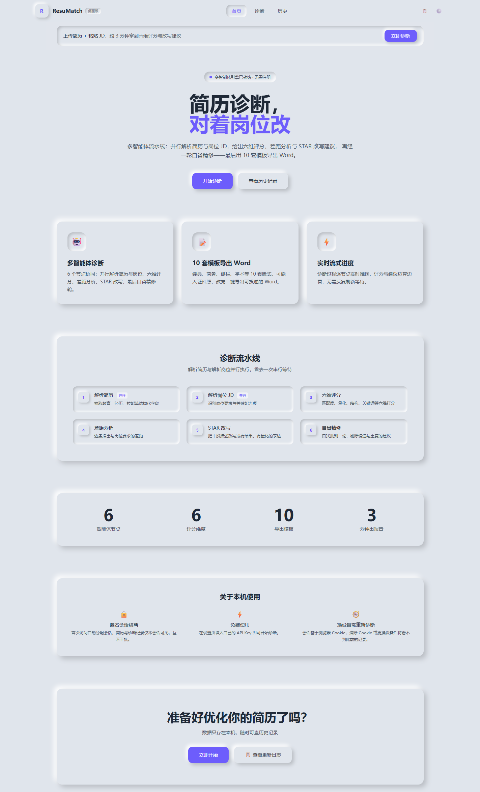

# ResuMatch AI

> 上传简历 + 粘贴岗位 JD → LangGraph 多节点 LLM 诊断（解析 ∥ 岗位分析 → 评分 → 差距 → 改写）→ 差距分析 / 对答式优化 → 10 套模板导出 Word（支持嵌入证件照）


---

## 目录

- [项目简介](#项目简介)
- [核心特性](#核心特性)
- [界面演示](#界面演示)
- [技术栈](#技术栈)
- [系统架构](#系统架构)
- [快速开始](#快速开始)
- [桌面版（免安装分发）](#桌面版免安装分发)
- [网站部署模式](#网站部署模式)
- [项目结构](#项目结构)
- [API 一览](#api-一览)

---

## 项目简介

ResuMatch AI 是一个**简历诊断工具**：你上传一份简历，再粘贴目标岗位的 JD 文本，AI 会从六个维度给简历打分、指出与岗位的差距、给出可落地的改写建议，并生成一份可以导出 Word 的优化简历。

不做岗位爬取、不依赖预置岗位库 —— JD 完全由用户提供，诊断结果更聚焦、更真实。

## 核心特性

- **多格式简历解析**：支持 PDF / DOCX / TXT，DOCX 会一并提取表格内容，避免表格式简历丢信息
- **JD 粘贴即用**：无爬虫、无岗位库依赖，从 BOSS / 智联 / 拉勾复制 JD 直接粘贴
- **LangGraph 诊断链**：解析简历 ∥ 解析岗位 → 六维评分 → 差距分析 → 改写建议，实时进度可视化
- **RAG 证据接地**：简历/JD 条目级分块检索，差距与建议必须引用简历原文（`[R3]`），无据自动标「推断」——消融实验证明贡献 +8 分且消除无据推断（见 [`docs/ResuMatch-AI-技术说明文档.md`](docs/ResuMatch-AI-技术说明文档.md) 第 13 章）
- **动态多轮追问（人在回路）**：AI 基于信息缺口动态生成 0-3 个追问（LangGraph interrupt 暂停 → 前端问题卡片 → 回答后恢复续跑），信息充分不打断，解决固定轮次机械感
- **对答式深度优化**：AI 追问补充经历细节后生成定制优化简历，支持一键优化 / 逐题问答两种模式
- **10 套简历模板**：经典居中 / 侧栏双栏 / 商务蓝 / 典雅衬线 / 现代竖标 / 极简黑白 / 学术衬线 / 活力橙 / 单行页眉 / 紧凑单页
- **证件照嵌入**：上传 JPG/PNG 证件照，导出 Word 时自动排入一寸照位（侧栏双栏等模板）
- **编辑器实时预览 + PDF 打印**：改完即看，支持浏览器打印为 PDF
- **双形态交付**：桌面 exe（免安装双击即用）+ 网站（匿名会话隔离、无需注册）；界面按运行形态自适应——桌面版走紧凑 App 风格、隐藏外链并强调「数据只在本机」，网页版保留开源引流与每日配额提示

## 界面演示

**首页** —— landing 长页，顶部快入口条随滚动吸附，随时一键直达诊断



| 新建诊断 | 诊断报告 |
|---|---|
|  |  |

| 历史记录 | 设置（自带 API Key） |
|---|---|
|  |  |

## 技术栈

**后端**
- FastAPI + Uvicorn —— 异步 Web 框架
- LangGraph + langchain-openai —— 诊断工作流编排 + interrupt 人在回路，兼容 DeepSeek / 通义 / 智谱等 OpenAI 协议模型
- RAG-lite 证据检索 —— 条目级分块 + 纯 Python 余弦/IDF 关键词检索（零向量库依赖，embedding 不可用自动降级），证据接地可解释、抗幻觉
- SQLite（aiosqlite + WAL）—— 单文件库，免安装、支持并发读写
- PyMuPDF / python-docx —— 简历解析与 Word 生成（多模板 + 证件照排版）

**前端**
- Vue 3 (`<script setup>`) + Vue Router（hash 模式）
- Vite + Tailwind CSS
- ECharts —— 六维雷达图
- Axios

## 系统架构

```mermaid
flowchart TD
    A["简历上传<br/>PDF / DOCX → 文本"] --> D
    B["用户粘贴 JD 文本"] --> E
    R["evidence.py<br/>条目级分块 + RAG 检索"] -.-> F & G

    subgraph LG["LangGraph 诊断链"]
        direction LR
        D["parser<br/>结构解析"] --- E["job_analyze<br/>岗位解析"]
        E --> F["scorer<br/>六维评分<br/>按维度检索证据"]
        F --> G["gap<br/>差距分析<br/>差距必须引用 [R*] 原文"]
        G --> C["clarify<br/>动态追问 0-3 问<br/>interrupt 暂停"]
        C -->|用户回答后 Command(resume)| H["rewriter<br/>改写建议"]
        H --> I2["refine<br/>自省精修"]
    end

    I2 --> I["结果落库 SQLite<br/>历史可回看"]
    I --> J["对答式优化<br/>optimizer"]
    J --> K["简历编辑器<br/>10 套模板 + 证件照 + docx 实时预览"]
    K --> L["导出 Word / PDF"]
```

**RAG 证据接地**：诊断开始时把简历/JD 切成条目级证据块（`R1/J1…` 稳定 id），评分/差距/改写节点按需检索 Top-K 证据块注入 prompt；LLM 输出的证据引用经 `filter_valid_ids` 校验（防幻觉 id），无据差距自动标「推断」。embedding 服务不可用时自动降级 IDF 加权关键词检索（BM25-lite）。

**动态追问（人在回路）**：差距分析后 `clarify_plan` 节点按信息缺口生成 0-3 个问题，经 LangGraph `interrupt()` 暂停图执行并推送前端；用户答题后 `POST /live/clarify/{task_id}` 携 `Command(resume)` 恢复续跑改写与精修，全程状态由 MemorySaver checkpointer 保管（任务终态自动释放）。

**任务进度**通过内存任务表实时推送（前端轮询 `/live/status`），诊断结果落库 SQLite `diagnosis_records`；服务重启时启动补偿会把残留的 running 记录标记为失败，前端自动回落历史接口恢复结果。

**数据隔离**：所有业务表带 `owner_id` 列。本机/桌面形态固定 `local`；网站形态通过 HttpOnly 匿名会话 cookie 区分用户，老库由 `ensure_schema_columns()` 启动时自动补列迁移。

## 快速开始

### 环境要求

| 项目 | 版本 | 说明 |
|---|---|---|
| Python | 3.11+ | 推荐 conda / venv 隔离 |
| Node.js | 20+ | Vite 8 要求 |
| LLM API Key | — | 任意 OpenAI 协议兼容服务（DeepSeek 等） |

### 1. 配置后端

在 `backend/` 目录下创建 `.env`（该文件已在 `.gitignore` 中，不会被提交）：

```ini
DEBUG=True

# 任意 OpenAI 协议兼容模型
LLM_API_KEY=sk-xxxxxxxx
LLM_BASE_URL=https://api.deepseek.com
LLM_MODEL=deepseek-chat
```

数据库为内置 SQLite（`backend/data/resumatch.db`），启动时自动建表，无需安装任何数据库。

### 2. 安装后端依赖

```bash
cd backend
pip install -r requirements.txt
```

### 3. 启动后端

```bash
python run.py          # 推荐：自带依赖预检，默认 8765 端口
# 或
uvicorn app.main:app --reload --port 8765
```

启动后访问 `http://127.0.0.1:8765/docs` 查看交互式 API 文档。

### 4. 启动前端

```bash
cd frontend
npm install
npm run dev
```

访问 `http://localhost:5173`。Vite 已配置 `/api` 代理到后端，无需额外配置跨域。

### 5. 运行测试

```bash
cd backend
python -m pytest tests/ -q
```

## 桌面版（免安装分发）

不想装 Python / Node 也能用：项目可打包为**免安装桌面版**，双击即用，适合发给同学、考官或作为毕设现场演示。

```bash
cd backend
python build_desktop.py    # 任意 shell 可跑，产物在 release/ResuMatch-AI-桌面版/
```

- **pywebview 原生窗口**：默认窗口模式运行（Edge WebView2），异常时自动回退浏览器；`--no-browser` / `--browser` 可强制
- **无黑窗控制台**：`--windowed` 打包，运行日志写到 exe 同级 `data/logs/app.log`
- **单实例锁**：重复启动会自动聚焦已有窗口（识别 ResuMatch 健康响应，不误伤其它应用）
- 默认 **SQLite** 免安装，数据保存在 exe 同级 `data/resumatch.db`
- 大模型 API Key 由使用者在「设置」页填写，也可在 exe 同级放 `config.json` 预置（零配置分发）
- 包体约 55MB（已剔除 torch / Chromium / MySQL 驱动），Windows 10/11 实测通过

> **注意**：必须连同 `_internal` 文件夹一起拷贝，单独复制 `.exe` 无法运行。

## 网站部署模式

设置环境变量 `APP_MODE=web` 即切换为多用户网站形态：

- **匿名会话隔离**：首次访问自动签发 HttpOnly cookie（`rmsid`，30 天有效），无注册登录；也可用 `X-Session-Id` 请求头直调 API
- **每日配额**：使用服务端预置 Key 的诊断默认限 10 次/天（`WEB_DAILY_LIMIT`），用户在设置页自带 Key 则不限
- 简历 / 诊断记录 / 对话历史全部按会话隔离，互不可见

```bash
# 示例：以 web 模式启动
APP_MODE=web uvicorn app.main:app --host 0.0.0.0 --port 8765
```

## 项目结构

```
resumatch-ai/
├── backend/
│   ├── app/
│   │   ├── main.py                 # FastAPI 入口、lifespan（建表+老库补列+启动补偿）
│   │   ├── core/
│   │   │   ├── config.py           # pydantic-settings（APP_MODE / 会话 / 配额）
│   │   │   ├── deps.py             # get_owner_id 会话隔离依赖
│   │   │   └── db.py               # 异步引擎、ensure_schema_columns 老库补列
│   │   ├── models/entities.py      # Resume / DiagnosisRecord / Conversation
│   │   ├── api/v1/                 # resume / live / history / chat / optimize / settings / health
│   │   ├── services/               # resume_service / live_pipeline_service / diagnosis_service
│   │   ├── agents/                 # LangGraph 诊断工作流
│   │   │   └── nodes/              # parser / job_analyze / scorer / gap / rewriter
│   │   │                           # + refine（自省精修）/ optimizer / interactive_opt
│   │   └── utils/                  # file_parser、docx_generator（10 模板 + 证件照）
│   ├── scripts/evaluate.py         # 质量评估脚本（标注集 × 多次运行，产出评估报告）
│   ├── desktop.py                  # pywebview 桌面启动器
│   ├── build_desktop.py            # PyInstaller 打包脚本（one-folder）
│   ├── run.py                      # 开发启动脚本（sys.executable -m uvicorn）
│   ├── tests/                      # pytest 用例（API / 诊断图 / docx 生成）
│   └── requirements.txt
├── frontend/
│   └── src/
│       ├── api/index.js            # Axios 封装
│       ├── composables/            # useAppMode（桌面版/网页版界面切换）
│       ├── components/ResumePreview.vue
│       └── views/                  # Home / Analyze / Result / Editor / Chat / History / Settings / Changelog
└── docs/                           # 四件套：改造计划（迭代史）/ 技术说明文档（实现+踩坑+评估）/ 论文准备（知识点+答辩）/ 修改日志
```

## API 一览

启动后完整文档见 `/docs`，主要接口如下：

| 方法 | 路径 | 说明 |
|---|---|---|
| GET | `/api/v1/health` | 健康检查（含数据库连通性） |
| GET | `/api/v1/meta` | 运行形态元信息（桌面版/网页版、配额、版本），前端据此切换界面 |
| POST | `/api/v1/resumes/upload` | 上传简历并解析（≤10MB，按会话隔离） |
| GET | `/api/v1/resumes/{id}` | 查询简历 |
| GET | `/api/v1/resumes/templates` | 简历模板目录（10 套） |
| POST | `/api/v1/resumes/photo` | 上传证件照（JPG/PNG ≤5MB） |
| GET | `/api/v1/resumes/photo/{photo_id}` | 读取证件照 |
| DELETE | `/api/v1/resumes/photo/{photo_id}` | 删除证件照 |
| POST | `/api/v1/resumes/export-docx` | 导出优化简历为 Word（可指定模板与照片） |
| POST | `/api/v1/live/analyze` | 启动诊断：`{resume_id, jd_text, resume_name?, enable_refine?}` |
| GET | `/api/v1/live/stream/{task_id}` | **SSE 实时推送**诊断进度（前端主用） |
| GET | `/api/v1/live/status/{task_id}` | 查询任务进度与结果（内存优先，过期回退 DB） |
| POST | `/api/v1/live/clarify/{task_id}` | 提交动态追问回答，`Command(resume)` 恢复诊断链 |
| GET | `/api/v1/history` | 历史记录列表（按会话隔离） |
| GET/DELETE | `/api/v1/history/{task_id}` | 历史详情 / 删除 |
| POST | `/api/v1/optimize/{task_id}` | 一键优化 |
| POST | `/api/v1/chat/start|reply|finish/{task_id}` | 对答式优化 |
| GET | `/api/v1/chat/history/{task_id}` | 对话历史 |

**完整流程调用示例**

```bash
# 1. 上传简历
curl -X POST http://127.0.0.1:8765/api/v1/resumes/upload \
  -F "file=@我的简历.pdf"
# → {"id": 1, "filename": "我的简历.pdf", "text_length": 2143}

# 2. 启动诊断（粘贴 JD 文本）
curl -X POST http://127.0.0.1:8765/api/v1/live/analyze \
  -H "Content-Type: application/json" \
  -d '{"resume_id": 1, "jd_text": "岗位职责：负责后端服务开发……任职要求：3 年以上 Python 经验……", "resume_name": "我的简历.pdf"}'
# → {"task_id": "a1b2c3d4e5f6", "status": "pending"}

# 3. 轮询结果
curl http://127.0.0.1:8765/api/v1/live/status/a1b2c3d4e5f6
```

---

## 常见问题

<details>
<summary>8765 端口被占用</summary>

启动脚本会自动顺延到 8766+。控制台会打印实际端口，浏览器访问对应地址即可。
</details>

<details>
<summary>老版本数据库升级</summary>

直接启动即可：`ensure_schema_columns()` 会在启动时自动检查并补齐新增列（如 `owner_id`），历史数据自动归属本机用户，无需手动迁移。
</details>

<details>
<summary>LLM 返回内容不是合法 JSON</summary>

部分模型对结构化输出支持不完善。项目在 `agents/utils.py` 中做了三层兜底：剥离代码块标记 → 正则提取 JSON 片段 → 失败后追加纠错提示重试（最多 3 次）。
</details>

<details>
<summary>桌面版双击闪退</summary>

必须连同 `_internal` 文件夹一起拷贝。若窗口无法创建（缺 WebView2 运行时），程序会自动回退到系统浏览器打开；也可用 `--browser` 参数手动指定。
</details>

更多历史踩坑记录见 [`docs/ResuMatch-AI-技术说明文档.md`](docs/ResuMatch-AI-技术说明文档.md) 第 12 章。

---

## 开发路线

- [x] M1 清理：移除爬虫与 MySQL，SQLite 单文件库
- [x] M2 逻辑修复：resume_id 落库、任务状态持久化、启动补偿、keyword 回填岗位名
- [x] M3 桌面版强化：pywebview 窗口化、单实例锁、打包排除清单、exe 烟测
- [x] M4 网站化：owner 会话隔离、Web 每日配额、证件照、10 套简历模板
- [x] M5 收尾：历史文档重写、模板化前端预览
- [x] M6 SSE 实时进度 + 结果落库 + 自省精修（refine）+ 质量评估脚本
- [x] M7 桌面 exe 强化：任务串台修复、原生窗口、无控制台打包
- [x] M8 启动提速（52.6s → 2.1s）+ 双形态界面（桌面 App 风 / 网页引流）+ 首页重写
- [x] M9 清理回收 1.8GB（历史安装包 / 冗余环境文件）
- [x] M10 编辑器预览保真：docx-preview 直渲真实 Word 文件，预览与导出版式一致
- [x] M11 RAG 证据接地 + 动态多轮追问（interrupt 人在回路）+ 消融/稳定性评估
- [x] M12 检索 IDF 加权（BM25-lite）+ 空池防幻觉指令

---

## 免责声明

- 本项目为个人学习与技术研究成果，**不得用于任何商业用途**。
- 简历文件包含个人敏感信息，请勿将数据库文件分发他人；网站部署需自行补充传输加密与数据脱敏。
- LLM 生成的评分与建议仅供参考，不构成任何求职决策依据。

---

## License

[MIT](LICENSE) © 2026
