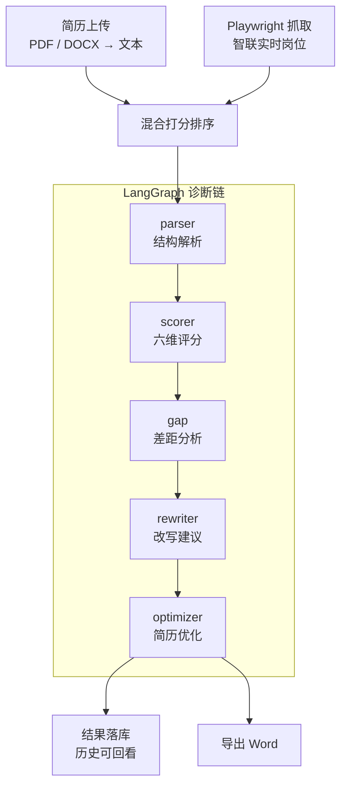

# ResuMatch AI

> 上传一份简历 → 直接使用用户提供的岗位 JD（不再实时爬取/匹配） → 混合打分排序 → 多节点 LLM 诊断 → 输出可落地的改写方案与优化简历


---

## 目录

- [项目简介](#项目简介)
- [核心特性](#核心特性)
- [效果预览](#效果预览)
- [技术栈](#技术栈)
- [系统架构](#系统架构)
- [快速开始](#快速开始)
- [桌面版（免安装分发）](#桌面版免安装分发)
- [项目结构](#项目结构)
- [API 一览](#api-一览)

**真实文件解析**
支持 PDF / DOCX / TXT，DOCX 会一并提取表格内容，避免表格式简历丢信息。

---

## 效果预览

| 页面 | 说明 |
|---|---|
| **首页** | 产品定位与功能入口 |
| **分析页** | 上传简历、填写目标岗位关键词与城市、启动诊断 |
| **结果页** | 六维雷达图、综合评分、Top 岗位列表、差距清单、改写建议、Word 导出 |
| **历史页** | 历次诊断记录，支持回看与删除 |

> 截图待补充：将运行截图放入 `docs/images/` 后，在此处引用即可。

---

## 技术栈

**后端**
- FastAPI + Uvicorn —— 异步 Web 框架
- LangGraph + langchain-openai —— 诊断工作流编排，兼容 DeepSeek / 通义 / 智谱等 OpenAI 协议模型
- sentence-transformers —— `paraphrase-multilingual-MiniLM-L12-v2` 中文语义向量（已配置 `hf-mirror` 国内镜像）
- Playwright (sync) —— 岗位抓取
- PyMuPDF / python-docx —— 简历解析与 Word 生成

**前端**
- Vue 3 (`<script setup>`) + Vue Router
- Vite + Tailwind CSS
- ECharts —— 六维雷达图
- Axios

---

## 系统架构



**状态持久化**采用双轨设计：内存任务表供实时进度查询，SQLite `diagnosis_records` 表供历史回看。服务重启导致内存任务丢失时，前端会自动回落到历史接口恢复结果。

---

## 快速开始

### 环境要求

| 项目 | 版本 | 说明 |
|---|---|---|
| Python | 3.11+ | 推荐 conda / venv 隔离 |
| Node.js | 20+ | Vite 8 要求 |
| LLM API Key | — | 任意 OpenAI 协议兼容服务（DeepSeek 等） |

### 1. 创建数据库

```sql
CREATE DATABASE resumatch
  CHARACTER SET utf8mb4
  COLLATE utf8mb4_unicode_ci;
```

数据表会在后端启动时自动创建，无需手动建表。

### 2. 配置后端

在 `backend/` 目录下创建 `.env`（该文件已在 `.gitignore` 中，不会被提交）：

```ini
APP_NAME=ResuMatch AI
APP_VERSION=0.1.0
DEBUG=True

# 注意：密码中的特殊字符需 URL 编码，如 @ 写成 %40

# 任意 OpenAI 协议兼容模型
LLM_API_KEY=sk-xxxxxxxx
LLM_BASE_URL=https://api.deepseek.com
LLM_MODEL=deepseek-chat
```

### 3. 安装后端依赖

```bash
cd backend

# 仅需 CPU 推理时，先单独安装 CPU 版 torch（避免拉取数 GB 的 CUDA 包）
pip install torch==2.14.0 --index-url https://download.pytorch.org/whl/cpu

pip install -r requirements.txt

# 安装 Playwright 浏览器内核
playwright install chromium
```

### 4. 启动后端

```bash
uvicorn app.main:app --reload --port 8000
```

启动后访问 `http://127.0.0.1:8000/docs` 查看交互式 API 文档。

> 首次调用匹配功能时会从 HuggingFace 镜像下载语义模型（约 470MB），请耐心等待。

### 5. 启动前端

```bash
cd frontend
npm install
npm run dev
```

访问 `http://localhost:5173`。Vite 已配置 `/api` 代理到后端 8000 端口，无需额外配置跨域。

---

## 桌面版（免安装分发）

不想装 Python / Node / MySQL 也能用：项目已打包为**免安装桌面版**，双击即用，适合发给同学、考官或作为毕设现场演示。

- 默认使用 **SQLite**（无需安装数据库），数据保存在 `data/resumatch.db`
- 语义匹配在无 GPU / 未内置模型时自动降级为「关键词 + TF-IDF 相似度」，诊断全流程仍可完整运行
- 大模型 API Key 由使用者在「设置」页填写自己的，也可在 exe 同级放 `config.json` 预置（详见包内 `使用说明.txt`）
- 包体约 17MB（已剔除 torch 与 Chromium），已在 Windows 10/11 实测：启动、建表、静态页、API、零配置 Key 全部通过

> 构建产物位于 `release/ResuMatch-AI-桌面版.zip`，解压后双击 `ResuMatch AI 桌面版.exe` 即可。
> **注意**：必须连同 `_internal` 文件夹一起拷贝，单独复制 `.exe` 无法运行。

---

## 项目结构

```
resumatch-ai/
├── backend/
│   ├── app/
│   │   ├── main.py                 # FastAPI 入口与路由注册
│   │   ├── core/
│   │   │   ├── config.py           # pydantic-settings 配置
│   │   │   └── db.py               # 异步引擎、Session、连接池
│   │   ├── models/                 # ORM 实体与出入参模型
│   │   ├── api/v1/                 # 路由层
│   │   │   ├── health.py  job.py  resume.py
│   │   │   ├── match.py  live.py  history.py
│   │   ├── services/               # 业务编排层
│   │   │   ├── resume_service.py       # 上传与解析
│   │   │   ├── match_service.py        # 岗位推荐
│   │   │   ├── diagnosis_service.py    # 诊断入口
│   │   │   ├── pipeline_service.py     # 匹配 + 诊断编排
│   │   │   └── live_pipeline_service.py# 爬取→入库→匹配→诊断 全流程
│   │   ├── agents/                 # LangGraph 诊断工作流
│   │   │   ├── graph.py  state.py  llm.py  utils.py
│   │   │   └── nodes/              # parser / scorer / gap / rewriter / optimizer
│   │   │   ├── feature_extractor.py    # 技能、学历、年限抽取
│   │   │   ├── semantic_matcher.py     # 句向量相似度
│   │   │   └── ranker.py               # 直接使用用户提供的岗位 JD（不再实时爬取/匹配）打分与排序
│   │   ├── crawlers/               # zhilian_sync（抓取）、pipeline（入库去重）
│   │   └── utils/                  # file_parser、docx_generator
│   ├── tests/                      # pytest 用例
│   ├── scripts/                    # 诊断流程验证脚本
│   └── requirements.txt
├── frontend/
│   └── src/
│       ├── api/index.js            # Axios 封装
│       ├── router/index.js
│       └── views/                  # Home / Analyze / Result / History
└── docs/                           # 技术说明文档、问题解决记录
```

---


启动后完整文档见 `/docs`，主要接口如下：

| 方法 | 路径 | 说明 |
|---|---|---|
| GET | `/api/v1/health` | 健康检查（含数据库连通性） |
| GET | `/api/v1/jobs` | 岗位列表 |
| POST | `/api/v1/resumes/upload` | 上传简历并解析（≤10MB） |
| GET | `/api/v1/resumes/{id}` | 查询简历 |
| POST | `/api/v1/resumes/diagnose` | 单独诊断（使用服务端 LLM 配置） |
| POST | `/api/v1/resumes/export-docx` | 导出优化简历为 Word |
| POST | `/api/v1/match/recommend` | 仅做岗位推荐 |
| POST | `/api/v1/match/with-diagnosis` | 推荐 + 诊断 |
| POST | `/api/v1/live/analyze` | 启动完整流程，返回 `task_id` |
| GET | `/api/v1/live/status/{task_id}` | 查询任务进度与结果 |
| GET | `/api/v1/history` | 历史记录列表 |
| GET | `/api/v1/history/{task_id}` | 历史记录详情 |
| DELETE | `/api/v1/history/{task_id}` | 删除记录 |

**完整流程调用示例**

```bash
# 1. 上传简历
curl -X POST http://127.0.0.1:8000/api/v1/resumes/upload \
  -F "file=@我的简历.pdf"
# → {"id": 1, "filename": "我的简历.pdf", "text_length": 2143}

# 2. 启动诊断
curl -X POST http://127.0.0.1:8000/api/v1/live/analyze \
  -H "Content-Type: application/json" \
  -d '{"resume_id": 1, "keyword": "Java后端", "city": "北京", "top_k": 10}'
# → {"task_id": "a1b2c3d4e5f6", "status": "pending"}

# 3. 轮询结果
curl http://127.0.0.1:8000/api/v1/live/status/a1b2c3d4e5f6
```

---


每个岗位的最终得分由四项加权得出：

```
score = 0.40 × 技能覆盖率
      + 0.30 × 语义相似度
      + 0.20 × 经验匹配度
      + 0.10 × 学历匹配度
```

**技能覆盖率** —— 从简历与岗位文本中抽取技能关键词（内置 100+ 技术栈词表），计算
`|简历技能 ∩ 岗位技能| / |岗位技能|`，同时返回 `matched_skills` 与 `missing_skills`。

**语义相似度** —— 使用 `paraphrase-multilingual-MiniLM-L12-v2` 分别编码简历与岗位文本，取余弦相似度并归一化到 `[0, 1]`。

**经验匹配度** —— 岗位年限区间内得满分，低于下限每年扣 20%，高于上限每年扣 10%（避免过度qualified 被过度惩罚）。

**学历匹配度** —— 简历学历不低于岗位要求得满分，每差一级扣 30%。

每一项分数都会随结果返回（`breakdown` 字段），排第一的岗位为什么是它，可以直接看出来。

---

## 常见问题

<details>

密码中的特殊字符需要 URL 编码。例如密码 `Pass@2024` 中的 `@` 必须写成 `%40`：

```ini
```

常见编码：`@` → `%40`，`#` → `%23`，`/` → `%2F`，`:` → `%3A`。
</details>

<details>
<summary>Windows 上 Playwright 报事件循环错误</summary>

Playwright 的异步 API 与 uvicorn 的事件循环在 Windows 上存在冲突。本项目改用 `sync_playwright`，在异步服务中通过 `asyncio.to_thread` 调用，规避该问题。详见 `docs/问题解决记录.md`。
</details>

<details>
<summary>安装 torch 时下载了几个 GB</summary>

`pip install torch` 默认拉取 CUDA 版本。仅做 CPU 推理时请先执行：

```bash
pip install torch==2.14.0 --index-url https://download.pytorch.org/whl/cpu
```
</details>

<details>
<summary>首次匹配很慢 / HuggingFace 下载失败</summary>

项目已在 `semantic_matcher.py` 中设置 `HF_ENDPOINT=https://hf-mirror.com` 国内镜像。首次调用仍需下载约 470MB 模型，之后会缓存在本地。
</details>

<details>
<summary>LLM 返回内容不是合法 JSON</summary>

部分模型对结构化输出支持不完善。本项目在 `agents/utils.py` 中做了三层兜底：剥离代码块标记 → 正则提取 JSON 片段 → 失败后追加纠错提示重试（最多 3 次）。
</details>

更多环境配置、数据库、爬虫、LLM 相关的 20+ 个真实踩坑记录，见 [`docs/问题解决记录.md`](docs/问题解决记录.md)。

---

## 开发路线

- [ ] LangGraph 增加 self-refine 循环与 checkpoint，支持中断续跑
- [ ] 语义匹配改为批量编码，降低 N 倍推理开销
- [ ] 技能匹配改用词边界正则，修复 `django` 命中 `go` 类误报
- [ ] 引入 Alembic 管理数据库迁移
- [ ] 增加用户鉴权与接口限流

---

## 免责声明

- 本项目为个人学习与技术研究成果，**不得用于任何商业用途**。
- 岗位数据仅用于个人匹配分析，抓取频率低、数量少，任务结束后立即从数据库删除，不做留存与二次分发。请遵守目标网站的服务条款与 `robots.txt`。
- 简历文件包含个人敏感信息，请勿部署在公网环境。生产使用需自行补充鉴权、传输加密与数据脱敏。
- LLM 生成的评分与建议仅供参考，不构成任何求职决策依据。

---

## License

[MIT](LICENSE) © 2026