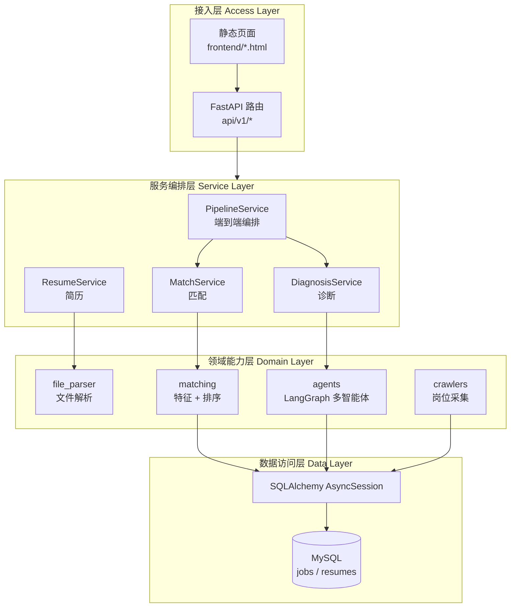
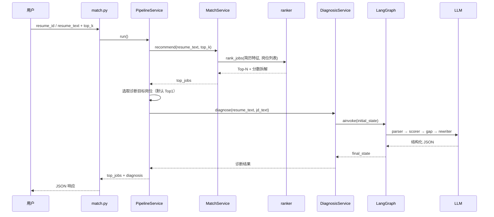
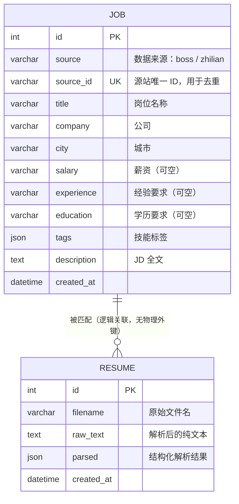
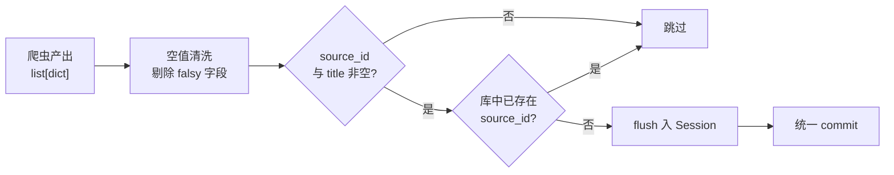
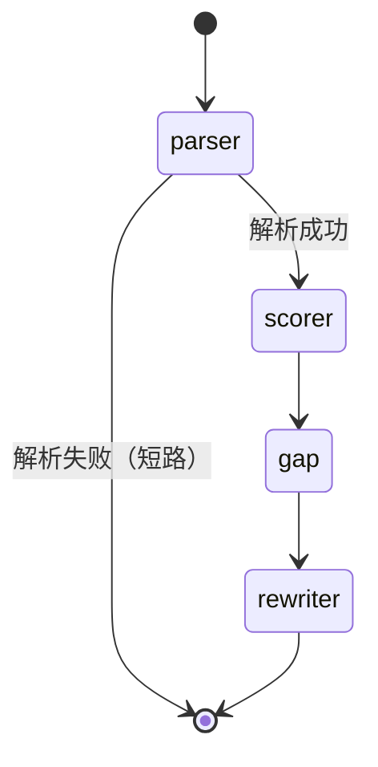
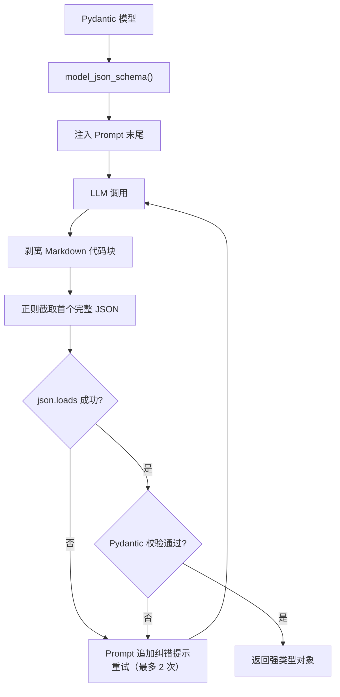

# ResuMatch AI 技术说明文档

> 面向岗位的智能简历匹配与多智能体诊断系统
> 文档版本 v1.0 ｜ 项目版本 v0.1.0 ｜ 2026-09-10

---

## 目录

- [1. 项目概述](#1-项目概述)
- [2. 需求分析](#2-需求分析)
- [3. 技术选型](#3-技术选型)
- [4. 系统架构设计](#4-系统架构设计)
- [5. 数据库设计](#5-数据库设计)
- [6. 核心模块设计](#6-核心模块设计)
- [7. 接口设计](#7-接口设计)
- [8. 前端设计](#8-前端设计)
- [9. 系统运行与部署](#9-系统运行与部署)
- [10. 已知问题与改进计划](#10-已知问题与改进计划)
- [11. 附录](#11-附录)

---

## 1. 项目概述

### 1.1 研究背景

在校园招聘与实习申请场景中，求职者面临两个典型痛点：

1. **人岗信息不对称**。主流招聘平台的检索方式以关键词匹配为主，求职者难以判断"我到底适不适合这个岗位"，只能凭感觉海投，反馈率低。
2. **简历优化缺乏针对性**。市面上多数简历评测工具只做通用性打分（格式、错别字、篇幅），无法结合**具体目标岗位**给出差异化的改进方向。

与此同时，大语言模型在文本理解与结构化抽取上的能力已经成熟，但单一 Prompt 驱动的"一问一答"式简历点评存在明显缺陷：输出发散、缺少中间过程、无法定位到简历的具体段落。

### 1.2 项目目标

ResuMatch AI 的设计目标是构建一套**可解释**的简历—岗位匹配与诊断系统，实现：

| 目标 | 具体指标 |
| --- | --- |
| 精准匹配 | 从岗位库中召回与简历最相关的 Top-N 岗位，并给出可拆解的分数构成 |
| 深度诊断 | 输出结构化解析、六维评分、与岗位的差距清单、可执行的改写建议 |
| 过程可解释 | 每个分数都能拆到子维度；每条建议都能追溯到具体的差距 |
| 配置可插拔 | 大模型供应商、参数均可按请求动态指定，不绑定单一厂商 |

### 1.3 主要创新点

**（1）规则特征与语义向量的混合匹配模型**

系统没有单纯依赖关键词命中或单纯依赖向量检索，而是将两类信号加权融合：关键词层保证技能维度的**可解释性**（能明确列出"命中了哪些、缺了哪些"），语义层补充同义与上下文信息（如"熟悉高并发系统"与"具备大流量服务经验"）。四个子分数（技能/语义/经验/学历）的构成会随结果一并返回，用户可以看到分数的来源。

**（2）基于状态图的多智能体协作诊断**

将复杂的简历诊断任务拆解为**解析、评分、差距分析、改写**四个职责单一的智能体，通过 LangGraph 的 `StateGraph` 组织为有向图，共享一份类型化的 `DiagnosisState`。相比单次大模型调用，这种设计有三个直接收益：

- 下游 Agent 能复用上游的结构化输出（如差距分析可直接引用解析结果与评分），减少重复推理；
- 单个环节失败不会污染全局，可通过 `error` 字段短路终止并保留已完成的部分结果；
- 每个 Agent 可独立调整温度参数——抽取类任务低温（0.1）保证稳定，生成类任务高温（0.5）保证多样性。

**（3）面向结构化输出的容错解析机制**

多数开源模型并不稳定支持 Function Calling / JSON Mode。系统为此设计了一套"Schema 注入 + 正则兜底 + 失败重述"的三层容错：把 Pydantic 模型的 JSON Schema 直接写进 Prompt，对返回值先剥离 Markdown 代码块、再用正则截取首个完整 JSON 对象，解析失败时把错误提示追加进 Prompt 重试。该机制使系统可以低成本切换任意 OpenAI 协议兼容的模型（智谱 GLM、DeepSeek、本地 Ollama 等）。

### 1.4 术语表

| 术语 | 含义 |
| --- | --- |
| JD | Job Description，岗位描述 |
| Top-N | 按匹配分排序后取前 N 个结果 |
| STAR | Situation-Task-Action-Result，结构化描述经历的常用范式 |
| Agent | 本系统中指承担单一职责的大模型调用单元 |
| StateGraph | LangGraph 提供的有状态有向图抽象 |

---

## 2. 需求分析

### 2.1 功能性需求

| 编号 | 需求名称 | 说明 | 实现位置 |
| --- | --- | --- | --- |
| F-01 | 简历上传与解析 | 支持 PDF / DOCX / DOC / TXT，提取纯文本（含 DOCX 表格） | `app/utils/file_parser.py` |
| F-02 | 简历入库 | 原始文本与元信息落库，供后续复用 | `app/services/resume_service.py` |
| F-03 | 岗位数据采集 | 按关键词 + 城市爬取岗位，支持翻页、去重、清洗入库 | `app/crawlers/` |
| F-04 | 岗位检索 | 分页查询岗位列表 | `app/api/v1/job.py` |
| F-05 | 岗位匹配排序 | 简历文本 → Top-N 岗位 + 分数拆解 | `app/matching/ranker.py` |
| F-06 | 简历结构化解析 | 抽取教育/工作/项目/技能/画像摘要 | `app/agents/nodes/parser_agent.py` |
| F-07 | 简历多维评分 | 六维度打分 + 综合分 | `app/agents/nodes/scorer_agent.py` |
| F-08 | 人岗差距分析 | 输出 3-6 条差距及严重程度 | `app/agents/nodes/gap_agent.py` |
| F-09 | 改写建议生成 | 基于 STAR 结构给出 3-5 条可落地建议 | `app/agents/nodes/rewriter_agent.py` |
| F-10 | 端到端流水线 | 匹配 + 诊断一步完成 | `app/services/pipeline_service.py` |
| F-11 | 模型配置可插拔 | 每次请求可指定 api_key / base_url / model | `app/agents/llm.py` |
| F-12 | 健康检查 | 校验服务与数据库连通性 | `app/api/v1/health.py` |

### 2.2 非功能性需求

| 类型 | 要求 | 当前实现 |
| --- | --- | --- |
| 性能 | 纯匹配响应 < 3s；端到端（含诊断）< 60s | 匹配为内存计算 + 模型缓存；诊断受限于 4 次串行 LLM 调用 |
| 可用性 | 服务异常不影响已入库数据 | 各 Agent 独立 try/except，失败短路而非崩溃 |
| 可扩展性 | 新增招聘平台只需实现抽象基类 | `BaseJobCrawler` 抽象基类 + 模板方法 |
| 可移植性 | 不绑定特定大模型厂商 | 统一走 OpenAI 兼容协议 |
| 安全性 | 上传文件限制 10MB；支持用户自带密钥 | 已实现文件大小校验与 per-request 密钥 |

---

## 3. 技术选型

| 层次 | 技术 | 版本 | 选型理由 |
| --- | --- | --- | --- |
| Web 框架 | FastAPI | 0.141 | 原生异步、自动生成 OpenAPI 文档、Pydantic 深度集成 |
| ASGI 服务器 | Uvicorn | 0.52 | 高性能异步服务器，支持热重载 |
| ORM | SQLAlchemy | 2.0 | 2.0 风格的 `Mapped`/`mapped_column` 声明式模型，原生 async 支持 |
| 数据库 | MySQL | 8.x | 异步驱动 `asyncmy`，连接池参数可调 |
| 数据校验 | Pydantic | 2.13 | 同时用于 API Schema 与 LLM 输出 Schema，一处定义两处复用 |
| 多智能体框架 | LangGraph | — | 以状态图组织 Agent，天然支持条件边与共享状态 |
| 模型接入 | langchain-openai | — | OpenAI 协议兼容层，可对接智谱/DeepSeek/Ollama |
| 语义向量 | sentence-transformers | — | `paraphrase-multilingual-MiniLM-L12-v2`，多语言、体积小、CPU 可跑 |
| 爬虫 | Playwright | — | 处理动态渲染页面，`--disable-blink-features` 降低被识别风险 |
| 重试 | tenacity | — | 指数退避重试，应对网络抖动 |
| 文档解析 | PyMuPDF / python-docx | — | PDF 与 DOCX 文本提取 |
| 日志 | loguru | — | 开箱即用的结构化日志 |
| 前端 | 原生 HTML + Tailwind CDN + ECharts | — | 免构建，降低部署复杂度 |

### 关于异步数据库访问

项目全程使用异步数据库访问（`create_async_engine` + `AsyncSession`）。核心原因是诊断接口涉及 4 次串行的大模型网络调用，单次耗时可达数十秒；若使用同步 ORM，每个请求都会长时间独占工作线程，并发能力会被迅速耗尽。

连接池配置如下：

```python
create_async_engine(
    settings.DB_URL,
    poolclass=AsyncAdaptedQueuePool,
    pool_size=10,          # 常驻连接
    max_overflow=20,       # 峰值额外连接
    pool_recycle=1800,     # 30 分钟回收，规避 MySQL 空闲断连
    pool_pre_ping=True,    # 取连接前探活，自动重连
)
```

---

## 4. 系统架构设计

### 4.1 总体架构

系统采用四层架构，自顶向下依次为接入层、服务编排层、领域能力层、数据访问层。



### 4.2 目录结构

```
resumatch-ai/
├── app/
│   ├── main.py                 # FastAPI 应用入口、生命周期、静态资源挂载
│   ├── api/v1/                 # 接口层
│   │   ├── health.py           #   健康检查
│   │   ├── job.py              #   岗位查询
│   │   ├── resume.py           #   简历上传 / 诊断
│   │   └── match.py            #   匹配 / 端到端流水线
│   ├── core/
│   │   ├── config.py           #   Pydantic Settings 配置
│   │   └── db.py               #   异步引擎、Session 工厂、Base
│   ├── models/
│   │   ├── entities.py         #   ORM 实体（Job / Resume）
│   │   └── schemas.py          #   API 出入参 Schema
│   ├── repositories/
│   │   └── job_repo.py         #   岗位数据访问
│   ├── services/               # 业务编排
│   │   ├── match_service.py
│   │   ├── resume_service.py
│   │   ├── diagnosis_service.py
│   │   └── pipeline_service.py #   匹配 + 诊断串联
│   ├── matching/               # 匹配算法
│   │   ├── feature_extractor.py
│   │   ├── semantic_matcher.py
│   │   └── ranker.py
│   ├── agents/                 # 多智能体
│   │   ├── graph.py            #   StateGraph 定义
│   │   ├── state.py            #   共享状态
│   │   ├── llm.py              #   模型工厂
│   │   ├── utils.py            #   结构化输出容错
│   │   └── nodes/              #   parser / scorer / gap / rewriter
│   ├── crawlers/               # 岗位采集
│   │   ├── base.py
│   │   ├── zhilian.py
│   │   └── pipeline.py
│   └── utils/
│       └── file_parser.py
├── frontend/
│   ├── index.html              # 上传与配置页
│   └── result.html             # 结果展示页
├── data/                       # 测试用简历样本
├── scripts/                    # 独立验证脚本
└── requirements.txt
```

### 4.3 端到端请求链路

以核心接口 `POST /api/v1/match/with-diagnosis` 为例：



---

## 5. 数据库设计

### 5.1 E-R 图

当前版本包含两张核心表，二者在业务上通过"一次诊断会话"产生关联，但物理上未建立外键约束（诊断过程不落库，为无状态计算）。



### 5.2 表结构说明

**表 `jobs` —— 岗位表**

| 字段 | 类型 | 约束 | 说明 |
| --- | --- | --- | --- |
| `id` | INT | PK, AUTO_INCREMENT | 主键 |
| `source` | VARCHAR(32) | INDEX | 数据来源平台标识 |
| `source_id` | VARCHAR(64) | UNIQUE, INDEX | 源站 ID，入库去重依据 |
| `title` | VARCHAR(128) | INDEX | 岗位名称 |
| `company` | VARCHAR(128) | INDEX | 公司名称 |
| `city` | VARCHAR(32) | INDEX | 城市 |
| `salary` | VARCHAR(64) | NULL | 薪资区间文本 |
| `experience` | VARCHAR(32) | NULL | 经验要求文本 |
| `education` | VARCHAR(32) | NULL | 学历要求文本 |
| `tags` | JSON | DEFAULT [] | 技能标签数组 |
| `description` | TEXT | | JD 全文 |
| `created_at` | DATETIME | DEFAULT NOW() | 创建时间 |

**表 `resumes` —— 简历表**

| 字段 | 类型 | 约束 | 说明 |
| --- | --- | --- | --- |
| `id` | INT | PK, AUTO_INCREMENT | 主键 |
| `filename` | VARCHAR(255) | | 原始文件名 |
| `raw_text` | TEXT | | 解析后的纯文本 |
| `parsed` | JSON | DEFAULT {} | 预留的结构化解析结果 |
| `created_at` | DATETIME | DEFAULT NOW() | 创建时间 |

> **设计说明**：`resumes.parsed` 目前写入空字典，结构化解析由诊断流水线在内存中实时计算而不落库。这样设计的原因是不同目标岗位会产出不同的差距与建议，落库的是"简历原文"这一稳定数据，"解析结果"属于岗位相关的派生数据。

---

## 6. 核心模块设计

### 6.1 简历文件解析模块

**职责**：把异构的简历文件统一转换为纯文本。

**实现要点**：

- 按扩展名分派解析器，`.pdf` → PyMuPDF，`.docx/.doc` → python-docx，`.txt` 直接读取；
- DOCX 解析同时遍历 `paragraphs` 与 `tables`，表格行以 ` | ` 拼接，避免丢失用表格排版的经历信息；
- 提供 `parse_bytes()` 供 FastAPI `UploadFile` 使用（落临时文件 → 解析 → 删除），并在 `finally` 中保证临时文件被清理；
- 解析结果为空时抛 `ValueError`，由接口层转为 400 响应，避免空文本进入下游。

```python
def parse_resume_file(path):
    suffix = Path(path).suffix.lower()
    if suffix == ".pdf":
        text = parse_pdf(path)
    elif suffix in (".docx", ".doc"):
        text = parse_docx(path)
    elif suffix == ".txt":
        text = path.read_text(encoding="utf-8")
    else:
        raise ValueError(f"不支持的文件类型: {suffix}")
    if not text:
        raise ValueError(f"文件解析后为空: {path}")
    return text
```

### 6.2 岗位数据采集模块

**类结构**：`BaseJobCrawler` 定义 `fetch_job_list()` 与 `fetch_job_detail()` 两个抽象方法，`ZhilianCrawler` 实现智联招聘的列表页采集；`JobPipeline` 负责清洗与入库。

**关键设计**：

1. **动态页面渲染**：使用 Playwright 启动无头 Chromium，注入真实 UA 与 viewport，并通过 `--disable-blink-features=AutomationControlled` 隐藏自动化特征。
2. **翻页终止判定**：记录本页所有 `source_id`，若与历史集合完全重合则判定已到末页，避免对超页请求做无谓处理（智联在页码越界时可能返回首页内容）。
3. **幂等去重**：以 `md5(title|company|location)[:16]` 生成 `source_id`；入库前先查询再插入，避免触发 `IntegrityError` 污染 Session。
4. **批量提交**：循环中只 `flush()` 不 `commit()`，末次统一提交；单条失败时 `rollback()` 后继续，保证一条脏数据不影响整批。

**入库流程**：



### 6.3 岗位匹配与排序模块

这是系统的**算法核心**，分为特征抽取、语义计算、加权融合三步。

#### 6.3.1 特征抽取

`feature_extractor.py` 从简历与岗位两侧抽取同构特征：

| 特征 | 简历侧 | 岗位侧 | 抽取方式 |
| --- | --- | --- | --- |
| 技能集合 | `ResumeFeatures.skills` | `JobFeatures.skills` | 基于 120+ 技术关键词词典的文本包含匹配；岗位侧额外并入 `tags` 字段 |
| 学历等级 | `education_level` | `education_level` | 学历词表映射为序数（不限0/高中1/大专2/本科3/硕士4/博士5），取文本中出现的最高等级 |
| 经验年限 | `experience_years` | `min` / `max` | 简历侧正则匹配"N 年工作经验"；岗位侧匹配 "A-B 年" / "N 年以上" |

#### 6.3.2 子分数计算

**技能匹配分**（召回率口径）：

$$
S_{skill} = \frac{|Skills_{resume} \cap Skills_{job}|}{|Skills_{job}|}
$$

岗位无技能要求时返回 0.5 中性值；简历无技能时返回 0。

**经验匹配分**（分段线性）：

$$
S_{exp} = \begin{cases}
1.0, & lo \le y \le hi \\
\max(0,\ 1 - 0.2(lo - y)), & y < lo \\
\max(0,\ 1 - 0.1(y - hi)), & y > hi
\end{cases}
$$

低于下限惩罚更重（0.2/年），高于上限惩罚较轻（0.1/年）——经验不足比经验溢出更影响录用。

**学历匹配分**：达到要求记满分，每差一级扣 0.3，最低 0。

**语义相似分**：使用 `paraphrase-multilingual-MiniLM-L12-v2` 对简历全文与 JD 全文编码，`normalize_embeddings=True` 后取点积即余弦相似度，再线性映射到 $[0,1]$：

$$
S_{sem} = \frac{\cos(\vec{v}_{resume}, \vec{v}_{job}) + 1}{2}
$$

模型通过 `lru_cache` 单例缓存，避免每次请求重复加载（加载耗时约数秒）。

#### 6.3.3 加权融合

$$
Score = 0.40\,S_{skill} + 0.30\,S_{sem} + 0.20\,S_{exp} + 0.10\,S_{edu}
$$

权重分配的逻辑：技能是招聘筛选的硬门槛，权重最高；语义作为泛化补充次之；经验与学历属于区间性约束，权重较低。

**输出的可解释性**：除总分外，接口同时返回 `breakdown`（四个子分的百分制值）、`matched_skills`（命中技能）与 `missing_skills`（缺失技能，最多 10 个），用户可以直接看到"为什么是这个分"。

### 6.4 多智能体诊断模块

#### 6.4.1 状态图结构



解析节点后接条件边：若 `state["error"]` 非空则直接跳转 `END`，后续节点各自在入口处再次检查 `error` 并直接返回空更新（幂等保护）。

#### 6.4.2 共享状态

```python
class DiagnosisState(TypedDict, total=False):
    # 输入
    resume_text: str
    jd_text: str
    llm_config: dict
    # 各 Agent 输出
    parsed: dict
    scores: dict
    gaps: list
    suggestions: list
    # 控制流
    error: str
    messages: Annotated[list, operator.add]
```

`messages` 使用 `Annotated[list, operator.add]`，使各节点追加的消息在执行过程中自动累积而不是被覆盖，最终形成一条完整的执行轨迹。

#### 6.4.3 四个 Agent 的职责与参数

| Agent | 职责 | 输出模型 | 温度 | 设计考量 |
| --- | --- | --- | --- | --- |
| `parser` | 抽取教育/工作/项目/技能，生成一句话画像 | `ParsedResume` | 0.1 | 抽取类任务，追求稳定与忠实原文 |
| `scorer` | 六维度打分（完整性/量化/STAR/技能含金量/业绩/可读性）+ 综合分 | `ResumeScores` | 0.2 | 需要一定判断力，但仍要求可复现 |
| `gap` | 对比 JD，输出 3-6 条差距及严重程度（high/medium/low） | `GapAnalysis` | 0.3 | 依赖上游的解析与评分结果 |
| `rewriter` | 基于 STAR 结构产出 3-5 条改写建议 | `RewriteResult` | 0.5 | 生成类任务，需要多样性与创造性 |

链路的依赖关系：`gap` 的 Prompt 显式注入了 `parsed` 与 `scores`，`rewriter` 的 Prompt 注入了 `scores` 与 `gaps`。这种"上游产出即下游上下文"的设计，使最终建议与前面的分析保持逻辑一致，而非各自独立生成。

#### 6.4.4 结构化输出的容错机制

这是保证系统**可移植**的关键。多数模型不支持稳定的 Function Calling，因此系统不依赖 `with_structured_output`，而是：



`scorer` 的 `overall` 字段还额外加了 `field_validator(mode="before")`，处理模型偶发把 `overall` 输出成 `{"score": 74}` 而非 `74` 的情况——这类防御性处理是实际跑通低成本模型的必要代价。

#### 6.4.5 模型可插拔

`llm.py` 的工厂函数接受可选的 `api_key/base_url/model`，未提供时回退到 `.env` 全局配置：

```python
final_key   = api_key   or settings.LLM_API_KEY
final_base  = base_url  or settings.LLM_BASE_URL
final_model = model     or settings.LLM_MODEL
if not final_key:
    raise ValueError("未配置 LLM API Key，请在设置中填写，或联系管理员")
```

配置从 API 层（`LLMConfig` 模型）经 `PipelineService` → `DiagnosisService` → `DiagnosisState.llm_config` → 各 Agent 逐层透传，用户可在页面上自带密钥试用。

---

## 7. 接口设计

所有接口前缀为 `/api/v1`，完整文档由 FastAPI 自动生成于 `/docs`。

| 方法 | 路径 | 说明 |
| --- | --- | --- |
| GET | `/health` | 健康检查，返回应用信息与数据库连通状态 |
| GET | `/jobs` | 岗位列表，支持 `limit` / `offset` 分页 |
| POST | `/resumes/upload` | 上传并解析简历（multipart/form-data，≤10MB） |
| GET | `/resumes/{resume_id}` | 查询简历元信息 |
| POST | `/resumes/diagnose` | 简历 + JD 文本 → 多智能体诊断（不落库） |
| POST | `/match/recommend` | 简历文本 → Top-N 岗位（纯匹配） |
| POST | `/match/with-diagnosis` | 端到端：匹配 Top-N + 目标岗位诊断 |

### 7.1 `POST /api/v1/match/with-diagnosis`（核心接口）

**请求示例**

```json
{
  "resume_id": 1,
  "top_k": 10,
  "diagnose_job_id": null,
  "skip_diagnosis": false,
  "llm_config": {
    "api_key": "sk-xxx",
    "base_url": "https://open.bigmodel.cn/api/paas/v4/",
    "model": "glm-4-flash"
  }
}
```

> `resume_id` 与 `resume_text` 至少提供一个；`diagnose_job_id` 为空时默认诊断 Top1 岗位；`skip_diagnosis=true` 可只跑匹配以加速。

**响应结构**

```json
{
  "top_jobs": [
    {
      "job_id": 42,
      "title": "后端开发工程师",
      "company": "某某科技",
      "city": "北京",
      "score": 78.35,
      "breakdown": {
        "skill": 66.67,
        "semantic": 82.10,
        "experience": 100.0,
        "education": 100.0
      },
      "matched_skills": ["python", "fastapi", "mysql"],
      "missing_skills": ["redis", "docker", "kubernetes"]
    }
  ],
  "diagnosis_target": { "job_id": 42, "title": "后端开发工程师", "company": "某某科技", "city": "北京" },
  "diagnosis": {
    "parsed": { "education": [], "experience": [], "projects": [], "skills": [], "summary": "" },
    "scores": { "completeness": {"score": 75, "comment": "..."}, "overall": 74 },
    "gaps": [ { "dimension": "技能", "description": "...", "severity": "high" } ],
    "suggestions": [ { "target": "...", "original": "...", "rewritten": "...", "reason": "..." } ],
    "error": "",
    "messages": [ { "role": "parser", "content": "解析完成" } ]
  }
}
```

### 7.2 `GET /api/v1/health`

```json
{ "status": "ok", "app": "ResuMatch AI", "version": "0.1.0", "db": "ok" }
```

数据库不可达时 `db` 字段返回具体错误信息，便于部署后快速定位。

---

## 8. 前端设计

前端采用免构建的原生实现（Tailwind CSS CDN + ECharts），共两个页面。

**`index.html` —— 配置与上传页**

左侧为使用说明与功能入口，右侧为操作区：简历上传（拖拽/点击，限制 `.pdf/.docx/.doc`）、目标 JD 补充输入、城市选择、Top-N 滑块。提交后跳转结果页并透传参数。

**`result.html` —— 结果展示页**

| 区块 | 内容 |
| --- | --- |
| 岗位匹配列表 | Top-N 岗位卡片，展示总分与命中/缺失技能标签 |
| 能力雷达图 | ECharts 渲染的六维评分雷达 |
| 综合评分 | 大模型给出的总分与技能标签云 |
| 差距分析 | 按严重程度分组的差距条目 |
| 改写建议 | 逐条展示 原文 → 改写后 + 理由 |

加载态与结果态通过 `hidden` 类切换，诊断耗时较长时展示等待提示。

---

## 9. 系统运行与部署

### 9.1 环境准备

```bash
# 1. 创建虚拟环境
python -m venv .venv
.venv\Scripts\activate          # Windows
# source .venv/bin/activate     # Linux / macOS

# 2. 安装依赖
pip install -r requirements.txt

# 3. 安装 Playwright 浏览器内核（仅爬虫功能需要）
playwright install chromium
```

### 9.2 配置

在项目根目录创建 `.env`：

```ini
APP_NAME=ResuMatch AI
APP_VERSION=0.1.0
DEBUG=true

# 数据库连接串
DB_URL=mysql+asyncmy://<user>:<password>@127.0.0.1:3306/resumatch?charset=utf8mb4

# 大模型（任意 OpenAI 协议兼容服务）
LLM_API_KEY=your_api_key
LLM_BASE_URL=https://open.bigmodel.cn/api/paas/v4/
LLM_MODEL=glm-4-flash
```

> 密码中的 `@` 需转义为 `%40`。

### 9.3 初始化数据库

应用启动时通过 `lifespan` 自动执行 `Base.metadata.create_all` 建表，无需手工执行 DDL。需先手动创建数据库：

```sql
CREATE DATABASE resumatch CHARACTER SET utf8mb4 COLLATE utf8mb4_unicode_ci;
```

### 9.4 采集岗位数据

```python
import asyncio
from app.crawlers.zhilian import ZhilianCrawler
from app.crawlers.pipeline import JobPipeline

async def main():
    crawler = ZhilianCrawler(headless=True)
    jobs = await crawler.fetch_job_list("Java开发", city="北京", max_pages=5)
    await JobPipeline().process(jobs)

asyncio.run(main())
```

### 9.5 启动服务

```bash
uvicorn app.main:app --host 0.0.0.0 --port 8000 --reload
```

启动后访问：

- 首页：<http://127.0.0.1:8000/>
- 接口文档：<http://127.0.0.1:8000/docs>
- 健康检查：<http://127.0.0.1:8000/api/v1/health>

> 首次调用涉及语义模型的接口会触发模型下载（约数百 MB）。国内环境已通过 `HF_ENDPOINT=https://hf-mirror.com` 配置镜像源。

---

## 10. 已知问题与改进计划

### 10.1 待修复问题

| 编号 | 问题 | 影响 | 建议方案 |
| --- | --- | --- | --- |
| B-01 | `requirements.txt` 缺失 `langgraph`、`langchain-openai`、`sentence-transformers`、`playwright`、`tenacity`、`pymupdf`、`python-docx`、`numpy` 等实际使用的依赖 | 换环境无法复现 | 重新生成完整的依赖清单 |
| B-02 | `tests/` 目录为空，无任何自动化测试 | 无测试报告，回归风险高 | 优先为 `ranker` 与 `feature_extractor` 补单元测试 |
| B-03 | `gap_agent` 往 `gaps` 列表末尾追加了 `{"summary": ...}` 字典，与列表中的 `GapItem` 结构不一致 | 下游消费方需特殊处理 | 将 `summary` 提升为独立状态字段 |
| B-04 | `MatchService` 一次性 `select(Job)` 加载全表后在内存中排序 | 岗位量增长后成为瓶颈 | 先按城市/关键词做 SQL 预筛，再进入打分 |
| B-05 | `/resumes/diagnose` 接口不支持传入 `llm_config` | 与其他接口的模型配置能力不一致 | 为 `DiagnoseRequest` 增加该字段 |
| B-06 | 无用户体系，简历与诊断结果无归属 | 无法做历史记录，隐私数据无隔离 | 增加注册登录与用户外键 |
| B-07 | 无任何算法效果的量化评估 | 无法证明方法有效性 | 见 10.2 |

### 10.2 实验验证方案（建议优先补做）

当前系统尚未建立量化评估，这是后续最需要补齐的部分。建议方案：

**数据集**：构造 100-200 组"简历—岗位"配对，由人工标注是否匹配（二分类）或对候选岗位做相关性分级（0-3 分）。

**对比方法（Baseline）**：

| 方法 | 描述 |
| --- | --- |
| 关键词重合度 | 仅用 TF 加权的词袋余弦相似度 |
| TF-IDF + 余弦 | 传统信息检索基线 |
| 纯向量检索 | 仅使用 `S_sem`，不做规则加权 |
| 纯 LLM 打分 | 直接让大模型对"简历—岗位"打分排序 |
| **本文方法** | 规则特征 + 语义向量的四维权加融合 |

**评价指标**：

$$
\text{Precision@}k = \frac{\text{Top-}k \text{ 中相关岗位数}}{k}
\qquad
\text{NDCG@}k = \frac{DCG@k}{IDCG@k}
\qquad
\text{MRR} = \frac{1}{|Q|}\sum_{i}\frac{1}{rank_i}
$$

建议取 $k=5, 10$。此外可做**消融实验**：逐一移除四个子分数，观察指标下降幅度，用于论证权重设计的合理性。

### 10.3 合规性说明

岗位数据采集模块仅用于学术研究与系统功能验证。实际使用时应：

- 遵守目标网站的 `robots.txt` 与服务条款；
- 控制请求频率（当前实现每页间隔 1.5-2 秒）；
- 不存储、不传播涉及个人隐私的字段；
- 不用于任何商业用途。

---

## 11. 附录

### 11.1 核心依赖清单

```
fastapi                # Web 框架
uvicorn                # ASGI 服务器
sqlalchemy[asyncio]    # 异步 ORM
asyncmy                # MySQL 异步驱动
pydantic               # 数据校验
pydantic-settings      # 配置管理
python-multipart       # 文件上传
langgraph              # 多智能体编排
langchain-openai       # OpenAI 协议模型接入
sentence-transformers  # 语义向量
playwright             # 动态页面采集
tenacity               # 重试
pymupdf                # PDF 解析
python-docx            # DOCX 解析
loguru                 # 日志
pytest                 # 测试（待补充）
```

> 完整版本请以更新后的 `requirements.txt` 为准。

### 11.2 关键配置参数

| 参数 | 默认值 | 说明 |
| --- | --- | --- |
| `pool_size` | 10 | 数据库连接池常驻连接数 |
| `max_overflow` | 20 | 峰值额外连接数 |
| `pool_recycle` | 1800s | 连接回收周期 |
| 上传大小上限 | 10 MB | 接口层校验 |
| LLM 超时 | 60s | 单次调用超时 |
| LLM 重试 | 2 次 | 客户端层重试；结构化输出另有 2 次重述重试 |
| 语义模型 | `paraphrase-multilingual-MiniLM-L12-v2` | 输出 384 维向量 |

### 11.3 指标定义

| 指标 | 含义 |
| --- | --- |
| Precision@k | Top-k 结果中相关项占比 |
| NDCG@k | 归一化折损累计增益，考虑排序位置 |
| MRR | 首个相关结果排名倒数的均值 |

---

*本文档依据项目当前代码状态编写，随版本迭代同步更新。*
