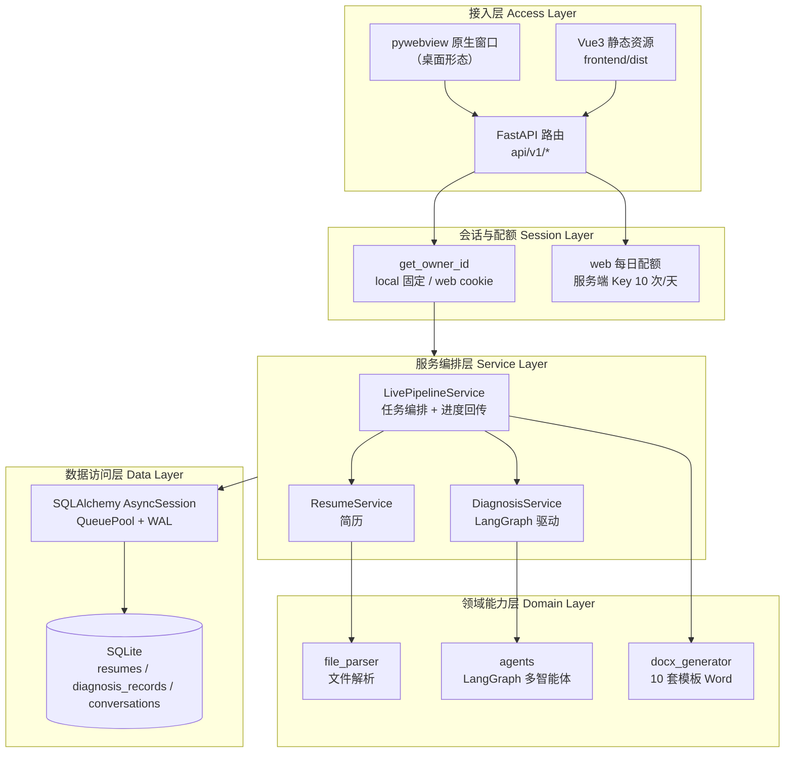
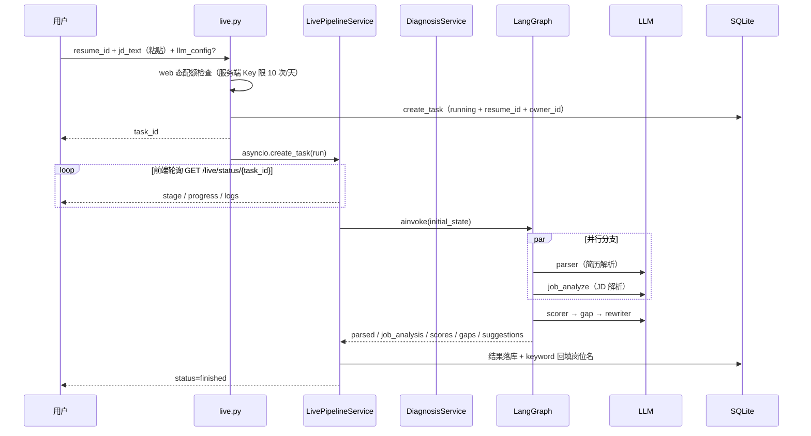
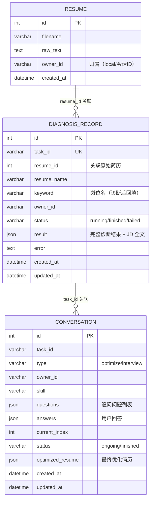
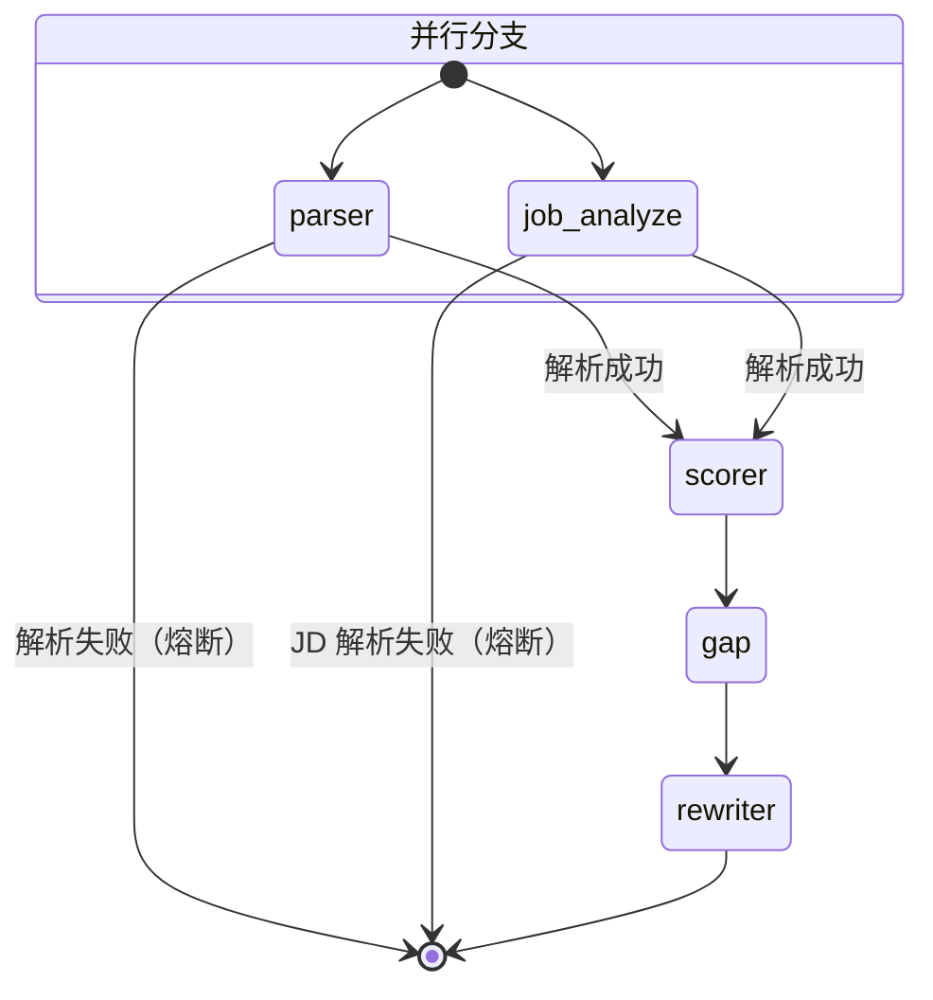
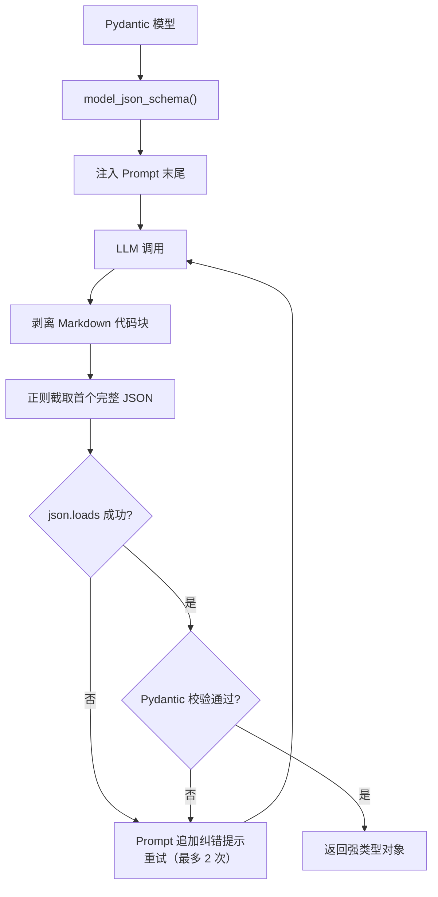

# ResuMatch AI 技术说明文档

> 面向岗位的智能简历诊断与优化系统
> 文档版本 v2.0 ｜ 项目版本 v0.1.0 ｜ 2026-09-18（依据当前代码全文重写）

---

## 目录

- [1. 项目概述](#1-项目概述)
- [2. 需求分析](#2-需求分析)
- [3. 技术选型](#3-技术选型)
- [4. 系统架构设计](#4-系统架构设计)
- [5. 数据库设计](#5-数据库设计)
- [6. 核心模块设计](#6-核心模块设计)
- [7. 接口设计](#7-接口设计)
- [8. 前端设计](#8-前端设计)
- [9. 系统运行与部署](#9-系统运行与部署)
- [10. 已知问题与改进计划](#10-已知问题与改进计划)
- [11. 附录](#11-附录)

---

## 1. 项目概述

### 1.1 研究背景

在校园招聘与实习申请场景中，求职者面临两个典型痛点：

1. **人岗信息不对称**。求职者难以判断"我到底适不适合这个岗位"，只能凭感觉海投，反馈率低。
2. **简历优化缺乏针对性**。市面上多数简历评测工具只做通用性打分（格式、错别字、篇幅），无法结合**具体目标岗位**给出差异化的改进方向，更不能直接给出可用的改写结果。

与此同时，大语言模型在文本理解与结构化抽取上的能力已经成熟，但单一 Prompt 驱动的"一问一答"式简历点评存在明显缺陷：输出发散、缺少中间过程、无法定位到简历的具体段落。

### 1.2 项目目标

ResuMatch AI 的设计目标是构建一套**可解释、可交付**的简历—岗位诊断与优化系统：

| 目标 | 具体体现 |
| --- | --- |
| 深度诊断 | 简历解析 ∥ JD 解析（并行）→ 六维评分 → 差距清单 → STAR 改写建议 |
| 过程可解释 | 每个分数都能拆到子维度；每条建议都能追溯到具体的差距 |
| 结果可交付 | 对答式补全信息后生成结构化优化简历，导出多模板 Word（可嵌证件照） |
| 零门槛使用 | 桌面版免安装免配置（SQLite 单文件库）；网站版匿名会话即开即用 |
| 配置可插拔 | 大模型供应商、参数均可按请求动态指定，不绑定单一厂商 |

### 1.3 与早期版本的关键差异

项目经历了一次方向性重构（详见 `docs/改造计划.md`）：

| 维度 | 早期版本 | 当前版本 |
| --- | --- | --- |
| 岗位数据 | Playwright 爬取招聘网站 + 城市筛选 | **不做爬取**，JD 由用户直接粘贴全文 |
| 数据库 | MySQL（asyncmy 驱动） | **内置 SQLite**（aiosqlite + WAL），免安装 |
| 前端 | 原生 HTML + CDN 免构建 | **Vue 3 + Vite** 工程化单页应用 |
| 交付形态 | 单机 Web 服务 | **双形态**：桌面 exe（pywebview）+ 可上线网站（APP_MODE=web） |
| 用户体系 | 无归属 | **匿名会话隔离**（owner_id），web 态配额限流 |

### 1.4 主要技术亮点

**（1）基于状态图的多智能体协作诊断，解析阶段并行化**

诊断任务被拆解为职责单一的 Agent，通过 LangGraph `StateGraph` 组织。其中简历解析（parser）与 JD 解析（job_analyze）输入相互独立，从 `START` 同时出发**并行执行**，相比串行流水线省去一次完整的大模型等待；任一分支出错即通过条件边熔断终止，保留已完成的部分结果。

**（2）面向结构化输出的容错解析机制**

多数开源/低价模型并不稳定支持 Function Calling / JSON Mode。系统设计了"Schema 注入 + 正则兜底 + 失败重述"的三层容错：把 Pydantic 模型的 JSON Schema 直接写进 Prompt，对返回值先剥离 Markdown 代码块、再用正则截取首个完整 JSON 对象，解析失败时把错误提示追加进 Prompt 重试。该机制使系统可以低成本切换任意 OpenAI 协议兼容的模型（智谱 GLM、DeepSeek、本地 Ollama 等）。

**（3）双形态交付与匿名会话隔离**

同一套代码通过 `APP_MODE` 环境变量切换形态：

- `local`（桌面 exe / 本机）：固定 owner_id=`local`，单用户语义，数据落本地 SQLite；
- `web`（上线网站）：HttpOnly cookie 匿名会话（`rmsid`）区分用户，无需注册登录；使用服务端 Key 时按每日配额限流，用户自带 Key 不限。

**（4）10 套简历模板与证件照嵌入**

Word 导出端（python-docx）实现 10 套版式（居中/左对齐/同行页眉 + 侧栏双栏 + 衬线等），统一渲染器按模板参数（色彩、标记、是否 bullet、衬线字体）差异化渲染；前端预览按同一套模板参数实时排版，导出所见即所得。证件照经魔数白名单校验后以 uuid 文件名落盘，导出时嵌入一寸照位。

### 1.5 术语表

| 术语 | 含义 |
| --- | --- |
| JD | Job Description，岗位描述 |
| STAR | Situation-Task-Action-Result，结构化经历描述法 |
| Agent | 本系统中指承担单一职责的大模型调用单元 |
| StateGraph | LangGraph 提供的有状态有向图抽象 |
| owner_id | 数据归属标识（local 模式固定值；web 模式为匿名会话 ID） |

---

## 2. 需求分析

### 2.1 功能性需求

| 编号 | 需求名称 | 说明 | 实现位置 |
| --- | --- | --- | --- |
| F-01 | 简历上传与解析 | 支持 PDF / DOCX / DOC / TXT，提取纯文本（含 DOCX 表格） | `app/utils/file_parser.py` |
| F-02 | 简历入库 | 原始文本与 owner 归属落库，供诊断与对话阶段复用 | `app/services/resume_service.py` |
| F-03 | JD 粘贴输入 | 用户直接粘贴 JD 全文（≥20 字校验），JD 全文持久化进结果 | `app/api/v1/live.py` |
| F-04 | 端到端诊断 | 解析 ∥ JD 分析 → 评分 → 差距 → 改写，进度实时回传 | `app/services/live_pipeline_service.py` |
| F-05 | 历史记录 | 诊断任务落库，支持列表 / 详情 / 删除（按 owner 过滤） | `app/api/v1/history.py` |
| F-06 | 对答式优化 | 追问补全简历信息 → 交互式生成结构化优化简历 | `app/api/v1/chat.py` |
| F-07 | 一键优化 | 跳过追问，由 optimizer 直接产出优化简历 | `app/api/v1/optimize.py` |
| F-08 | 多模板 Word 导出 | 10 套版式，可选嵌入证件照 | `app/utils/docx_generator.py` |
| F-09 | 证件照管理 | 上传 / 读取 / 删除，魔数校验 JPG/PNG ≤5MB | `app/api/v1/resume.py` |
| F-10 | 模型配置可插拔 | 每次请求可指定 api_key / base_url / model，支持连接测试 | `app/agents/llm.py`、`app/api/v1/settings.py` |
| F-11 | 会话隔离与配额 | web 态匿名会话隔离数据；服务端 Key 每日配额 | `app/core/deps.py`、`app/api/v1/live.py` |
| F-12 | 健康检查与单实例签名 | 校验服务与数据库连通性；桌面单实例识别 | `app/api/v1/health.py` |

### 2.2 非功能性需求

| 类型 | 要求 | 当前实现 |
| --- | --- | --- |
| 性能 | 诊断端到端受限于 5 次串行/并行 LLM 调用；进度秒级回传 | LangGraph 节点流式回调 `on_progress`（async） |
| 可用性 | 服务异常不影响已入库数据；重启不产生僵尸任务 | Agent 独立容错短路；启动补偿把残留 running 标记 failed |
| 零部署成本 | 桌面用户免装数据库 / Python | SQLite 单文件库 + PyInstaller one-folder 分发 |
| 可移植性 | 不绑定特定大模型厂商 | 统一走 OpenAI 兼容协议 + 手写结构化输出 |
| 安全性 | 上传简历 ≤10MB；照片魔数白名单 + uuid 文件名防穿越；web 态会话隔离 | 各接口层校验 |
| 数据兼容 | 老库自动升级 | `ensure_schema_columns()` PRAGMA 检查 + ALTER TABLE 补列 |

---

## 3. 技术选型

| 层次 | 技术 | 选型理由 |
| --- | --- | --- |
| Web 框架 | FastAPI | 原生异步、自动生成 OpenAPI 文档、Pydantic 深度集成 |
| ASGI 服务器 | Uvicorn | 高性能异步服务器；桌面版以子进程方式拉起 |
| ORM | SQLAlchemy 2.0（async） | `Mapped`/`mapped_column` 声明式模型，`AsyncSession` 原生异步 |
| 数据库 | SQLite（aiosqlite） | **零安装零配置**，单文件便于桌面分发；WAL 支持并发读写 |
| 数据校验 | Pydantic 2.x | 同时用于 API Schema 与 LLM 输出 Schema，一处定义两处复用 |
| 多智能体框架 | LangGraph | 以状态图组织 Agent，天然支持条件边、并行分支与共享状态 |
| 模型接入 | langchain-openai | OpenAI 协议兼容层，可对接智谱/DeepSeek/Ollama |
| 文档解析 | PyMuPDF / python-docx | PDF 与 DOCX 文本提取 |
| Word 生成 | python-docx | 多模板简历排版 + 证件照嵌入 |
| 日志 | loguru | 开箱即用的结构化日志 |
| 前端框架 | Vue 3 + Vite | 组件化开发、构建产物为纯静态文件由后端直接托管 |
| UI 方案 | Tailwind CSS + Arco Design Vue | 新拟态风格自绘 + 现成组件（消息提示等） |
| 桌面窗口 | pywebview | 原生窗口承载前端页面，带浏览器回退 |
| 打包 | PyInstaller（one-folder） | 免安装分发；排除 MySQL 驱动 / torch / Chromium 控制体积（约 55MB） |

### 关于异步数据库访问与 SQLite

项目全程使用异步数据库访问（`create_async_engine` + `AsyncSession`）。核心原因是诊断接口涉及多次串行的大模型网络调用，单次耗时可达数十秒；同步 ORM 会让每个请求长时间独占工作线程。

迁移到 SQLite 后有两个关键工程点（踩坑详见《问题解决记录》）：

1. **连接池选型**：使用 `AsyncAdaptedQueuePool`（每会话独立连接）而非 `StaticPool`（全局共享单连接）——共享单连接在请求会话与后台任务会话并发 commit 时会互相 reset 游标。
2. **WAL 模式**：连接建立时统一执行 `PRAGMA journal_mode=WAL` + `busy_timeout=5000`，允许多读单写并发，缓解写锁竞争。

---

## 4. 系统架构设计

### 4.1 总体架构



### 4.2 目录结构

```
resumatch-ai/
├── backend/
│   ├── run.py                  # 开发/服务启动器：依赖预检 + uvicorn 子进程 + 端口顺延
│   ├── desktop.py              # 桌面启动器：pywebview 窗口 + 单实例锁 + 浏览器回退
│   ├── build_desktop.py        # PyInstaller 打包脚本（one-folder + 自校验）
│   ├── app/
│   │   ├── main.py             # FastAPI 入口：lifespan 建表/补列/补偿，静态托管
│   │   ├── api/v1/             # 接口层
│   │   │   ├── health.py       #   健康检查 / 单实例签名
│   │   │   ├── resume.py       #   简历上传 / 模板目录 / 证件照 / Word 导出
│   │   │   ├── live.py         #   诊断任务提交与状态轮询（含 web 配额）
│   │   │   ├── history.py      #   历史记录列表 / 详情 / 删除
│   │   │   ├── optimize.py     #   一键优化
│   │   │   ├── chat.py         #   对答式优化（追问 / 回答 / 生成 / 历史）
│   │   │   └── settings.py     #   Key 预置状态 / LLM 连接测试
│   │   ├── core/
│   │   │   ├── config.py       #   Pydantic Settings（config.json 预置 + .env）
│   │   │   ├── db.py           #   异步引擎（WAL）、Base、老库补列
│   │   │   ├── deps.py         #   get_owner_id 会话隔离
│   │   │   └── watermark.py    #   作者标识
│   │   ├── models/
│   │   │   ├── entities.py     #   ORM 实体（Resume / DiagnosisRecord / Conversation）
│   │   │   └── schemas.py      #   API 出入参 Schema
│   │   ├── services/
│   │   │   ├── live_pipeline_service.py  # 任务表 + 进度回传 + 落库
│   │   │   ├── diagnosis_service.py      # LangGraph 调用与状态映射
│   │   │   └── resume_service.py
│   │   ├── agents/
│   │   │   ├── graph.py        #   诊断图 / 优化图定义
│   │   │   ├── state.py        #   共享状态 DiagnosisState
│   │   │   ├── llm.py          #   模型工厂（per-request 配置）
│   │   │   ├── utils.py        #   结构化输出容错
│   │   │   └── nodes/          #   parser / job_analyze / scorer / gap / rewriter
│   │   │   │                   #   refine（自省精修）/ optimizer / interactive_opt
│   │   └── utils/
│   │       ├── file_parser.py
│   │       └── docx_generator.py  # 10 套模板 + 证件照
│   ├── tests/                  #   pytest 15 项（API / 模板 / 照片 / owner 隔离 / 诊断图）
│   └── data/                   #   resumatch.db + photos/（运行时生成）
├── frontend/                   # Vue 3 + Vite
│   └── src/
│       ├── views/              #   Home / Analyze / Result / Chat / Editor /
│       │                       #   History / Settings / Changelog
│       ├── components/
│       │   └── ResumePreview.vue  # 10 套模板实时预览
│       ├── api/index.js        #   axios 封装
│       └── router/index.js     #   hash 路由
├── docs/                       # 技术文档 / 改造计划 / 问题记录 / 截图
└── README.md
```

### 4.3 端到端请求链路

以核心流程 `POST /api/v1/live/analyze` 为例：



---

## 5. 数据库设计

### 5.1 E-R 图

三张业务表均带 `owner_id` 归属列（无物理外键，应用层过滤）：



### 5.2 表结构说明

**表 `resumes` —— 原始简历表**

| 字段 | 类型 | 说明 |
| --- | --- | --- |
| `id` | INTEGER | PK, 自增 |
| `filename` | VARCHAR(255) | 原始文件名 |
| `raw_text` | TEXT | 解析后的纯文本 |
| `owner_id` | VARCHAR(64), INDEX | 数据归属（默认 local） |
| `created_at` | DATETIME | 创建时间（UTC naive） |

**表 `diagnosis_records` —— 诊断记录表**

| 字段 | 类型 | 说明 |
| --- | --- | --- |
| `id` | INTEGER | PK, 自增 |
| `task_id` | VARCHAR(32), UNIQUE | 任务 ID（uuid4 前 12 位） |
| `resume_id` | INTEGER, NULL | 关联原始简历（chat/optimize 复用原文） |
| `resume_name` | VARCHAR(255), NULL | 展示名 |
| `keyword` | VARCHAR(64), INDEX | 岗位名，诊断完成后取 `job_analysis.summary` 前 24 字回填 |
| `owner_id` | VARCHAR(64), INDEX | 数据归属 |
| `status` | VARCHAR(16) | running / finished / failed |
| `result` | JSON, NULL | 完整诊断结果（含 JD 全文，供 chat / optimize 复用） |
| `error` | TEXT, NULL | 失败原因 |
| `created_at` / `updated_at` | DATETIME | 时间戳（UTC naive） |

**表 `conversations` —— 对话历史表**

对答式优化与模拟面试共用。`questions`/`answers` 存追问与回答，`optimized_resume` 存最终生成的结构化简历（编辑器数据源）。

### 5.3 老库升级机制

SQLite 的 `create_all` 不会给已存在的表加列。新增列统一登记在 `app/core/db.py` 的 `_SCHEMA_NEW_COLUMNS`（表名 → [(列名, DDL)]），`lifespan` 启动时调用 `ensure_schema_columns()`：

1. `PRAGMA table_info` 检查每表已有列；
2. 缺失列执行 `ALTER TABLE ... ADD COLUMN`；
3. 对已有行回填默认归属（`owner_id = 'local'`）。

该机制幂等，conftest（测试）与 lifespan（生产）共用同一份登记。

---

## 6. 核心模块设计

### 6.1 简历文件解析模块

按扩展名分派解析器：`.pdf` → PyMuPDF，`.docx/.doc` → python-docx，`.txt` 直接读取。DOCX 解析同时遍历 `paragraphs` 与 `tables`（表格行以 ` | ` 拼接），避免丢失用表格排版的经历信息。解析结果为空时抛 `ValueError`，接口层转 400。

### 6.2 会话隔离模块（owner）

`app/core/deps.py::get_owner_id` 作为 FastAPI 依赖注入所有读写端点：

```python
async def get_owner_id(request: Request, response: Response) -> str:
    if settings.APP_MODE != "web":
        return "local"                      # 桌面/本机：单用户
    header_sid = request.headers.get("X-Session-Id", "").strip()
    if header_sid:
        return header_sid[:64]              # API 直调优先
    cookie_sid = request.cookies.get(settings.SESSION_COOKIE, "").strip()
    if cookie_sid:
        return cookie_sid[:64]
    new_sid = uuid4().hex                   # 首次访问签发 HttpOnly cookie
    response.set_cookie(settings.SESSION_COOKIE, new_sid, httponly=True,
                        samesite="lax", max_age=SESSION_TTL_DAYS * 86400)
    return new_sid
```

所有业务端点（resume / live / history / chat / optimize）的查询均追加 `owner_id` 过滤，实现匿名会话之间的数据隔离。

### 6.3 任务编排模块（LivePipelineService）

- **创建即落库**：`create_task` 生成 task_id 后立即写入 `diagnosis_records`（status=running，携带 resume_id / resume_name / owner_id），进度状态仍存内存 `TASKS` 表供 `/live/status` 秒级轮询；
- **进度回传**：诊断各节点通过 `on_progress` async 回调更新内存任务的 stage / progress / logs；
- **TTL 清理**：完成条目超过 1 小时后惰性清理；
- **启动补偿**：内存任务表随进程消失，`lifespan` 启动时把残留的 running 记录统一标记为 failed（提示重新发起）；
- **keyword 回填**：诊断完成后取 `job_analysis.summary` 前 24 字写回 `keyword`，历史列表直接展示岗位名。

### 6.4 多智能体诊断模块

#### 6.4.1 状态图结构



parser 与 job_analyze 输入独立（简历 / JD），从 START 同时出发并行执行，两分支写不同 state key，汇合进 scorer 无冲突；任一分支出错通过条件边直达 END 熔断。后续节点在入口处再次检查 `error` 直接返回空更新（幂等保护）。

另有独立优化图：`START → optimizer → END`，接收诊断全部产出生成结构化优化简历；对答式场景由 interactive_opt 驱动（生成追问 + 整合回答产出优化简历）。

#### 6.4.2 共享状态

```python
class DiagnosisState(TypedDict, total=False):
    # 输入
    resume_text: str
    jd_text: str
    llm_config: dict
    # 各 Agent 输出
    parsed: dict            # parser：结构化简历
    job_analysis: dict      # job_analyze：JD 要求拆解
    scores: dict            # scorer：六维评分
    gaps: list              # gap：差距清单
    suggestions: list       # rewriter：改写建议
    optimized_resume: dict  # optimizer：优化后简历
    # 控制流
    error: Annotated[str | None, _merge_error]  # 并行分支各写一次，保留首个非空值
    messages: Annotated[list, operator.add]     # 执行轨迹自动累积
```

#### 6.4.3 五个 Agent 的职责与参数

| Agent | 职责 | 温度 | 设计考量 |
| --- | --- | --- | --- |
| `parser` | 抽取教育/工作/项目/技能，生成一句话画像 | 0.1 | 抽取类任务，追求稳定与忠实原文 |
| `job_analyze` | 拆解 JD 的硬性要求 / 加分项 / 关键词 | 0.2 | 与 parser 并行，输出供 scorer/gap 引用 |
| `scorer` | 六维度打分（完整性/量化/STAR/技能含金量/业绩/可读性）+ 综合分 | 0.2 | 需要判断力，但要求可复现 |
| `gap` | 对比 JD，输出 3-6 条差距及严重程度 | 0.3 | 显式注入 parsed 与 job_analysis |
| `rewriter` | 基于 STAR 结构产出 3-5 条改写建议 | 0.5 | 生成类任务，需要多样性 |

链路依赖："上游产出即下游上下文"——gap 的 Prompt 注入解析与 JD 分析结果，rewriter 注入评分与差距，保证最终建议与前面的分析逻辑一致。

#### 6.4.4 结构化输出的容错机制



针对低价模型的输出怪癖还做了防御性校验，如 `scorer` 的 `overall` 字段用 `field_validator(mode="before")` 兼容模型偶发输出 `{"score": 74}` 而非 `74` 的情况。

#### 6.4.5 模型可插拔

`llm.py` 工厂函数接受可选的 `api_key/base_url/model`，未提供时回退到全局配置（`.env` 或 exe 同级 `config.json` 预置）：

```python
final_key   = api_key   or settings.LLM_API_KEY
final_base  = base_url  or settings.LLM_BASE_URL
final_model = model     or settings.LLM_MODEL
if not final_key:
    raise ValueError("未配置 LLM API Key，请在设置中填写，或联系管理员")
```

配置从 API 层（`LLMConfig`）经 PipelineService → DiagnosisService → `DiagnosisState.llm_config` 逐层透传，用户可自带密钥试用。

### 6.5 Web 每日配额模块

`live.py::_check_web_quota`：仅 `APP_MODE=web` 且用户未自带 Key 时生效。按 UTC 日界统计该 owner 当日已创建的诊断记录数，达到 `WEB_DAILY_LIMIT`（默认 10）返回 429 并提示可改用自带 Key。SQLite 时间戳为 UTC naive，日期比较统一按 UTC。

### 6.6 多模板 Word 生成模块

`docx_generator.py` 双层结构：

- **模板参数表 `TEMPLATES`**：10 套模板的色彩方案（姓名/标题/正文/分割线色 + 侧栏底色）；
- **模板目录 `TEMPLATE_CATALOG`**：id / name / desc，经 `GET /resumes/templates` 下发前端；
- **统一渲染器**：`_header`（三种页眉版式 center/left/inline，带照片时转两列表格：左姓名联系方式右一寸照）+ `_render_body`（简介/教育/工作/项目 + 技能 + 证书，按模板差异化：标题标记 `▍`/`●`/`—`、是否 bullet、是否大写、行距、衬线字体宋体）；
- **侧栏模板 sidebar**：双列表格，左栏浅底色放照片/联系方式/技能/证书，右栏姓名 + 正文；
- **中文字体**：run 级显式设置 `w:eastAsia`，否则 Word 中文回落默认字体。

模板清单：classic（经典居中）/ sidebar（侧栏双栏）/ business（商务蓝）/ elegant（典雅衬线）/ modern（现代竖标）/ minimal（极简黑白）/ academic（学术衬线）/ creative（活力橙）/ twocol（单行页眉）/ compact（紧凑单页）。

### 6.7 证件照模块

`POST /resumes/photo` 上传：魔数白名单校验（JPG `\xff\xd8\xff` / PNG `\x89PNG`）、≤5MB、以 `uuid4().hex`（32 位十六进制）为文件名落盘——文件名即 photo_id，且 photo_id 参与正则白名单 `^[0-9a-f]{32}$` 校验，天然防路径穿越。`export-docx` 携带 `photo_id` 时定位文件嵌入一寸照位。

---

## 7. 接口设计

所有接口前缀为 `/api/v1`，完整文档由 FastAPI 自动生成于 `/docs`。

| 方法 | 路径 | 说明 |
| --- | --- | --- |
| GET | `/health` | 健康检查（应用信息 + 数据库连通状态） |
| GET | `/_sig` | 单实例签名（桌面版识别 ResuMatch 自身） |
| GET | `/resumes/templates` | 简历模板目录（10 套） |
| POST | `/resumes/upload` | 上传并解析简历（multipart，≤10MB） |
| GET | `/resumes/{resume_id}` | 查询简历元信息 |
| POST | `/resumes/photo` | 上传证件照（JPG/PNG ≤5MB → photo_id） |
| GET | `/resumes/photo/{photo_id}` | 读取证件照（预览） |
| DELETE | `/resumes/photo/{photo_id}` | 删除证件照 |
| POST | `/resumes/export-docx` | 优化简历 → Word（template + 可选 photo_id） |
| POST | `/live/analyze` | 提交诊断任务（resume_id + jd_text，web 态配额检查） |
| GET | `/live/status/{task_id}` | 轮询任务进度（stage/progress/logs） |
| GET | `/history` | 历史记录列表（owner 过滤） |
| GET | `/history/{task_id}` | 历史详情 |
| DELETE | `/history/{task_id}` | 删除记录 |
| POST | `/optimize/{task_id}` | 一键生成优化简历 |
| POST | `/chat/start/{task_id}` | 开始对答式优化（生成追问问题） |
| POST | `/chat/reply/{task_id}` | 提交回答 / 追加追问 |
| POST | `/chat/finish/{task_id}` | 结束对话，生成优化简历 |
| GET | `/chat/history/{task_id}` | 读取对话历史与优化结果 |
| GET | `/settings/llm-default` | 服务端是否已预置 Key（零配置分发） |
| POST | `/settings/test-llm` | LLM 连接测试（最小请求验证） |

### 7.1 `POST /api/v1/live/analyze`（核心接口）

**请求示例**

```json
{
  "resume_id": 1,
  "jd_text": "岗位职责：负责后端服务开发与维护……（粘贴 JD 全文，≥20 字）",
  "resume_name": "张三-Java后端",
  "llm_config": {
    "api_key": "sk-xxx",
    "base_url": "https://open.bigmodel.cn/api/paas/v4/",
    "model": "glm-4-flash"
  }
}
```

> `jd_text` 至少 20 字；`llm_config` 可省略（回退服务端配置）。web 态使用服务端 Key 时受每日配额限制。

**响应**

```json
{ "task_id": "a1b2c3d4e5f6", "status": "pending" }
```

随后前端轮询 `GET /live/status/{task_id}`，任务完成后 `result` 字段即完整诊断结果（与落库内容一致）。

### 7.2 会话标识传递

| 形态 | 机制 |
| --- | --- |
| local | 无需处理，固定 `owner_id=local` |
| web 浏览器 | 首次响应自动签发 HttpOnly cookie `rmsid`（30 天） |
| web API 直调 | 请求头 `X-Session-Id: <会话ID>`（优先于 cookie） |

---

## 8. 前端设计

Vue 3 + Vite 单页应用，hash 路由（`#/analyze`），构建产物 `frontend/dist` 由后端 FastAPI 静态托管（打包后内嵌 `_MEIPASS/web`）。

### 8.1 页面视图

| 路由 | 视图 | 职责 |
| --- | --- | --- |
| `/` | HomeView | 功能入口与说明 |
| `/analyze` | AnalyzeView | 简历上传 + JD 粘贴 + 模型配置 + 任务进度实时日志 |
| `/result/:taskId` | ResultView | 六维雷达图、综合评分、差距分析、改写建议、优化入口 |
| `/chat/:taskId` | ChatView | 对答式优化对话流 |
| `/editor/:taskId` | EditorView | 简历编辑器：表单编辑 + 模板选择 + 证件照上传 + 实时预览 + Word/PDF 导出 |
| `/history` | HistoryView | 诊断历史列表（岗位名/状态/时间），进入详情或删除 |
| `/settings` | SettingsView | LLM Key / base_url / model 配置与连接测试 |
| `/changelog` | ChangelogView | 版本更新说明 |

### 8.2 编辑器与多模板预览

EditorView 左侧为分区表单（基本信息/教育/工作/项目/技能/证书），右侧为 A4 实时预览：

- **模板下拉**：目录由后端 `GET /resumes/templates` 下发（失败时用内置兜底列表），切换即生效；
- **`ResumePreview.vue` 多模板渲染**：以配置表驱动（页眉版式 center/left/inline/sidebar、标题标记、是否 bullet、衬线、标题文案映射），配合 CSS 变量注入各模板色彩，与 Word 导出端共用同一套参数语义；sidebar 模板渲染为左侧浅色信息栏（照片/联系方式/技能/证书）+ 右侧正文双栏；
- **证件照**：本地 `URL.createObjectURL` 即时预览，上传成功拿 photo_id 随导出请求带上；
- **打印/PDF**：Teleport 打印专用区 + `@media print` 隐藏界面只留简历页（`@page size: A4`）。

### 8.3 数据流与容错

- 编辑数据经 `localStorage` 防抖自动保存，刷新不丢；
- 优化简历数据源按优先级回退：localStorage → sessionStorage（刚从对话页生成）→ `/chat/history` → `/history` 详情兜底；
- 后端返回的教育/工作/项目兼容字符串数组与对象数组两种格式（`normalizeArray` 智能解析时间/主体字段）。

---

## 9. 系统运行与部署

### 9.1 开发环境（源码运行）

```bash
# 后端（Windows conda 环境示例）
cd backend
pip install -r requirements.txt
python run.py          # 依赖预检 + uvicorn 启动；8765 被占用自动顺延 8766+

# 前端
cd frontend
npm install
npm run dev            # 开发热更新；生产用 npm run build 后由后端托管
```

### 9.2 配置

在 `backend/`（或 exe 同级）创建 `.env`：

```ini
# 运行形态：local=桌面/本机；web=线上网站
APP_MODE=local

# SQLite 单文件库路径（默认 BASE_DIR/data/resumatch.db，一般无需修改）

# 大模型（任意 OpenAI 协议兼容服务）
LLM_API_KEY=your_api_key
LLM_BASE_URL=https://open.bigmodel.cn/api/paas/v4/
LLM_MODEL=glm-4-flash
```

web 部署可追加：

```ini
SESSION_TTL_DAYS=30      # 匿名会话有效期
WEB_DAILY_LIMIT=10       # 服务端 Key 每日诊断配额
```

桌面分发用 exe 同级 `config.json` 预置（零配置开箱即用，同名环境变量优先级更高）：

```json
{ "LLM_API_KEY": "sk-xxx", "LLM_BASE_URL": "https://open.bigmodel.cn/api/paas/v4/", "LLM_MODEL": "glm-4-flash" }
```

### 9.3 数据库初始化

无需手工建库建表：首次启动 `lifespan` 自动创建 `data/resumatch.db` 并执行 `create_all` + 老库补列 + 启动补偿。

### 9.4 桌面 exe 构建（形态 A）

```bash
cd backend
python build_desktop.py
# 产物：release/ResuMatch-AI-桌面版/ + 同名 zip（约 55MB）
```

要点：PyInstaller one-folder；排除 MySQL 驱动 / torch / Chromium 控制体积；构建后自校验关键 DLL；启动器 `desktop.py` 提供 pywebview 原生窗口（异常时自动回退浏览器，`--no-browser` / `--browser` 可强制指定）；单实例锁通过健康端点签名识别，只拦 ResuMatch 自身。

### 9.5 网站部署（形态 B）

```bash
cd frontend && npm run build
cd backend
# .env 中 APP_MODE=web + 服务端 LLM_API_KEY
python run.py --host 0.0.0.0 --port 8765   # 或用 uvicorn/systemd/Nginx 反代
```

- 前端产物由后端直接托管，单进程即可上线；
- 访客自动分配匿名会话，数据相互隔离；使用服务端 Key 的访客受每日配额限制，自带 Key 不限；
- 建议前置 Nginx 做 TLS 终结与静态缓存。

### 9.6 自动化测试

```bash
cd backend
python -m pytest tests/    # 15 项：API / 模板目录 / 照片上传导出 / web 态 owner 隔离 / 诊断图（含精修开关）
```

测试直用开发库（conftest 手动建表 + 补列；ASGITransport 不触发 lifespan）。

---

## 10. 已知问题与改进计划

> 已完成项（I-01 多进程部署 / I-03 量化评估 / I-06 截图）见第 12 节改造计划 M6、M8。

| 编号 | 事项 | 说明 | 方向 |
| --- | --- | --- | --- |
| I-01 | HTML 预览与 Word 排版存在像素级差异 | 预览按同一套模板参数语义实现，但字号/间距与 docx 不完全一致 | 以导出文件为准；可探索 docx→HTML 转换 |
| I-02 | 语义匹配未启用 | 早期版本的关键词/向量混合匹配已随爬取方案一并移除；LLM 链路（岗位解析/差距分析）本身即语义主通道 | 如需岗位推荐可基于本地 JD 库重建 |
| I-03 | 对话式优化的追问轮次固定 | `interactive_opt_agent` 按预设维度追问 | 动态规划追问策略 |

---

## 11. 附录

### 11.1 核心依赖清单

```
fastapi                # Web 框架
uvicorn                # ASGI 服务器
sqlalchemy[asyncio]    # 异步 ORM
aiosqlite              # SQLite 异步驱动
pydantic / pydantic-settings  # 校验与配置
python-multipart       # 文件上传
langgraph              # 多智能体编排
langchain-openai       # OpenAI 协议模型接入
pymupdf                # PDF 解析
python-docx            # DOCX 解析与 Word 生成
loguru                 # 日志
pywebview              # 桌面窗口
pyinstaller            # 打包（构建期）
pytest / httpx         # 测试
```

> 完整版本以 `backend/requirements.txt` 为准。

### 11.2 关键配置参数

| 参数 | 默认值 | 说明 |
| --- | --- | --- |
| `APP_MODE` | `local` | 运行形态（local / web） |
| `SESSION_COOKIE` | `rmsid` | web 态会话 cookie 名 |
| `SESSION_TTL_DAYS` | 30 | 匿名会话有效期 |
| `WEB_DAILY_LIMIT` | 10 | 服务端 Key 每日诊断次数（UTC 日界） |
| `PHOTOS_DIR` | `data/photos` | 证件照存放目录 |
| 上传简历上限 | 10 MB | 接口层校验 |
| 证件照上限 | 5 MB | 魔数白名单 JPG/PNG |
| SQLite | WAL + busy_timeout 5000ms | 连接级 PRAGMA |
| LLM 超时 | 60s | 单次调用超时 |
| 端口 | 8765 起，占用自动顺延 | run.py 探测 |

### 11.3 相关文档

| 文档 | 内容 |
| --- | --- |
| `README.md` | 快速上手、界面演示、部署说明 |
| `docs/改造计划.md` | M1-M5 改造清单与进度 |
| `docs/问题解决记录.md` | 开发踩坑与解决方案 |

---

*本文档依据项目当前代码状态编写（v2.0，对应 M4 完成节点），随版本迭代同步更新。*
